<h1 align="center"> Welcome to WebDevination </h1>

[WebDevination](http://webdevination.onrender.com/) is a portmanteau of web development and divination. This project seeks to blend the ancient art of tarot reading with the power of modern technology. The interactive tarot game is designed to offer a unique user experience that updates the divinatory experience within a digital framework.

With design influences drawn from the classic terminal interface, combined with a beautiful set of cards generated using [MidJourney](https://www.midjourney.com/), the site introduces users to the concept of techno-divination which seeks to refresh and replicate the personal nature of in-person fortune telling. Javascript aids interactivity and helps to provide this authentic experience.

The [single card reading](http://webdevination.onrender.com/onecard.html), and [three card reading](http://webdevination.onrender.com/threecard.html) both encourage the user to tap into their intuition and use the cards for introspective inquiry. A revolutionary ['techno oracle'](http://webdevination.onrender.com/info.html) powered by [ChatGPT](https://chatgpt.com/) offers a unique and exciting addition to the cards, providing mysterious, metaphysical responses to the users questions. In addition to the card reading and AI oracle features, the site includes a dedicated page where users can explore the [unique card designs](http://webdevination.onrender.com/cards.html) and familiarise themselves with more specific meanings. For those wishing to learn or remember the cards, there's also an [interactive game](http://webdevination.onrender.com/learn.html) that challenges users to match card descriptions to the correct images, reinforcing their understanding in a fun and engaging way.

This project brings divination into the modern age, creating a space where the internet is justified as the perfect transcendental, immaterial environment for this practice which enables deeper connection and self-reflection.
## Table of Contents

  
<a href="#1">UX</a>

  

    
<a href="#2">Planning & Goals</a>

1.  <a href="#3">Business Goals</a>
2. <a href="#4">User Profiles</a>
3. <a href="#5">User Stories</a>
4. <a href="#6">Minimum Viable Product</a>
  

  
<a href="#7">Visual Design</a>

1. <a href="#8">Wireframes</a>
2. <a href="#9">Colour Palette</a>
3. <a href="#10">Icons</a>
4.  <a href="#11">Fonts</a>
5.  <a href="#12">Images</a>
6.  <a href="#13">Styling</a>

<a href="#14">Features</a>

<a href="#15">All Pages</a>

1. <a href="#16">Navbar</a>
2. <a href="#17">Footer</a>
3. <a href="#18">Preloader</a>

<a href="#19">Landing Page (index.html)</a>

1. <a href="#20">Text/Icon Animation</a>
2. <a href="#21">Enter Button</a>

<a href="#22">Readings Info & A.I Oracle Page (info.html)</a>

1. <a href="#23">Terminal Typed Welcome & Skip Button</a>
2. <a href="#24">Readings Selection</a>
3. <a href="#25">A.I Oracle</a>

 

<a href="#26">Reading's Pages (onecard.html & threecard.html)</a>

1. <a href="#27">Shuffle Feature</a>
2. <a href="#28">Draw Feature</a>
3. <a href="#29">Card Images & Descriptions</a>
4. <a href="#30">Modal</a>
5. <a href="#31">Fake Advertisment</a>

<a href="#32">Cards Page (cards.html)</a>

1. <a href="#33">Card Images</a>
2. <a href="#34">Flip Info</a>
3. <a href="#35">Suit Stories</a>

<a href="#36">Learn Page (learn.html)</a>

1. <a href="#37">Multiple Choice Game</a>
2. <a href="#38">Modal</a>

<a href="#39">Technologies Used</a>

<a href="#40">Languages</a>

1. <a href="#41">HTML</a>
2. <a href="#42">CSS</a>
3. <a href="#43">JavaScript</a> 

<a href="#44">Frameworks</a>

1. <a href="#45">Bootstrap 5</a>  
2. <a href="#46">Express.js</a>  
3. <a href="#47">Node.js</a>  

<a href="#38">Libraries & APIs</a>

1. <a href="#39">Font Awesome</a>  
2. <a href="#40">OpenAI API</a>  
3. <a href="#41">Aztro API</a>  
4. <a href="#42">Farmsense API</a>  

<a href="#43">Platforms</a>

1. <a href="#44">GitHub</a>  
2. <a href="#45">Render</a>  
3. <a href="#46">VS Code</a>  

<a href="#47">Other Tools</a>

1. <a href="#48">MidJourney</a>  
2. <a href="#49">Adobe Illustrator</a>  
3. <a href="#50">To WebP</a>  
4. <a href="#51">Trimmy</a>  
5. <a href="#52">Balsamiq</a>  
6. <a href="#53">Favicon Generator</a>  
7. <a href="#54">Procreate</a>  
8. <a href="#54a">ChatGPT</a>

<a href="#55">Testing</a>

1. <a href="#56">About Testing</a>
2. <a href="#57">Validation</a>
3. <a href="#58">Mobile & Desktop Testing</a>
4. <a href="#59">Manual Testing</a>
5. <a href="#60">User Story Testing</a>
6. <a href="#61">Bugs</a>

<a href="#61a">Deployment</a>

  
1. <a href="#61b">Render Deployment</a>

<a href="#62">Credits</a>

1. <a href="#64">Copyright Notice</a>
2. <a href="#65">Lisence For Use</a>
3. <a href="#66">Permitted Uses</a>
4. <a href="#67">Prohibited Uses</a>
5. <a href="#68">Trademark</a>
6. <a href="#69">No Warranty</a>

<a href="#70">Contact</a>

<h2 id="1"></h2>
<h2 id="2">UX - Planning & Goals</h2>

<h3 id="3">1. Business Goals</h3>

#### Primary Goal 
The primary objective of WebDevination is to seamlessly bring the ancient art of tarot reading into the digital age without compromising the experience. By blending modern web technology with the mystical world of divination, the site aims to create an immersive, authentic tarot experience that feels both modern and personal, guiding users through the process of self-discovery in a digital space.

#### Further business goals are:

Maintain Personal Connection

<li>Ensure that the experience of online tarot reading feels as intimate and connected as an in-person session, fostering a sense of trust and personalization for each user.</li>

 

Provide an Intuitive Experience

<li>Design the interface to be user-friendly and easy to navigate, allowing users to focus on the tarot reading itself rather than technical elements, ensuring a smooth, engaging experience.</li>

Educate, Empower, and Encourage Self-Discovery 

<li>Encourage users to learn more about tarot and their own intuition by offering educational elements alongside each reading, helping them understand the cards and their meanings in a deeper, more personal way. Foster a space that invites users to reflect, explore their emotions, and gain insights through the tarot, helping them grow personally and spiritually.</li>

Blending Aesthetics and Functionality

<li>Combine mystical tarot themes with the aesthetics of modern technology (like terminal interfaces), creating a visually appealing yet functional design that enhances the user experience without overshadowing the purpose of the site.</li>

Create a Transcendental Digital Space

<li>Offer a space where the intangible and transcendental nature of tarot can be experienced online, connecting users to both their own intuition and the ancient practice in a modern, accessible way.</li>

Promote Accessibility

<li>Ensure that the tarot experience is accessible to all users, regardless of their level of familiarity with tarot or technology, making it easy for anyone to access and enjoy.</li>

Establish an Online Presence

<li>Create a strong online presence that demonstrates technical and creative expertise, aiming to attract new opportunities and collaborations while showcasing the blend of art and web development.</li>

<h3 id="4">2. User Profiles</h3>

Experienced Pagan/Mystic

<li>A seasoned tarot practitioner seeking a digital space that maintains the sacred, intimate nature of in-person readings.</li>

Disabled Seeker

<li>A person with a disability who finds comfort and solace in tarot readings, requiring an accessible, personal online experience.</li>

Tech Enthusiast Looking for Meaning

<li>A software developer with an interest in spirituality, exploring how technology can enhance the tarot experience while maintaining its authentic essence. They are also interested in the dynamic and interactive elements on the site, it's design and functionality as well as the game itself.</li>

Folk Revival Enthusiast

<li>A person who has recently discovered tarot through the modern resurgence of interest in folk traditions, seeking a blend of contemporary spirituality and ancient practices in a digital format.</li>

Tarot Newcomer

<li>A curious individual intrigued by tarot, eager to learn and explore the practice through an intuitive and approachable platform.</li>

<h3 id="5">3. User Stories</h3>

* As an <b>experienced tarot practitioner</b>  I want the site to offer a digital tarot experience that feels as personal and sacred as an in-person reading so that I can connect deeply with the cards and trust the intuitive guidance they offer, without feeling detached from the mystic elements of the practice.
* As a <b>person with a disability who finds divination fun and accessible</b> I want the site to be easy to navigate using assistive technology, so I can experience the tarot readings in a way that feels personal, calming, and supportive, without feeling overwhelmed by design or functionality.
* As a <b> software developer with an interest in spirituality</b>  I want to interact with a tarot game that blends meaningful content with engaging, innovative design and functionality, so I can appreciate how the technical aspects of the site enhance the spiritual experience without overshadowing it.
* As <b>someone interested in the modern resurgence of folk traditions</b> I want the site to offer a contemporary approach to tarot that still maintains its roots in ancient practices, so I can experience tarot in a way that feels connected to both history and modern spirituality.
* As an <b>newcomer to tarot</b>  I want the site to provide a simple and approachable introduction to tarot, with easy-to-understand explanations and interactive features, so I can learn about tarot at my own pace and feel comfortable exploring the cards without feeling overwhelmed.

<h3 id="6">4. Minimum Viable Product</h3>

 

Responsive & Accessible Design
 
<li>Ensure the website is accessible and looks good on various devices (desktops, tablets, smartphones).</li>
<li>Implement accessibility features such as screen reader support, keyboard navigation, high-contrast mode, and adjustable text size. A simple, intuitive layout with clear navigation to make the site comfortable for users with disabilities.</li>

Navigation

<li> An easy-to-navigate menu that includes links which guide users around the site.</li>
 

 

 
Landing Page

<li>An animated and inviting landing page that helps set the 'mystic' feeling of the experience right from the start.</li>

About the Game

<li>Information that offers explination for the game and guides the user and optimises their experience before they start playing. Can be skipped.</li>

Interactive Tarot Game

<li> A basic tarot game offering a single card draw which presents answer to a yes/no question.</li>
<li> A basic tarot game offering a three card draw which provides more context about a question with cards representing past, present and future.</li>
<li> Written information about the chosen cards which supplements the user and helps them interpret their reading.</li>

Technical and Spiritual Fusion

 <li>A sleek, responsive design that reflects a balance between spirituality and modern tech, with interactive elements (such as smooth transitions when drawing cards) and clean, intuitive functionality.</li>
<li>Phosphourescent glowing green text on primarily black background to reference terminal display.</li>
<li>Unique card designs which complement the terminal aesthetic, reference the developer's artistic style and authentically connects the user to the symbolism of tarot.</li>
 

<h2 id="7">UX - Visual Design</h2>

<h3 id="8">1. Wireframes</h3>

Wireframes

### 1. Landing Page Wireframes (index.html)

| Mobile                                                   |   Desktop                                               |
|:----------------------------------------------------------:|:-----------------------------------------------------------:|
| 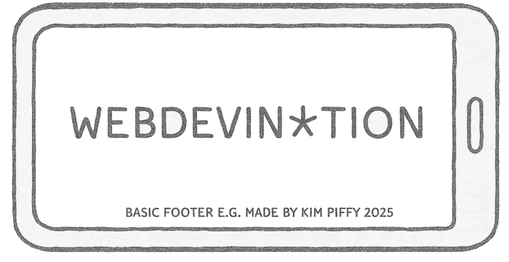 | 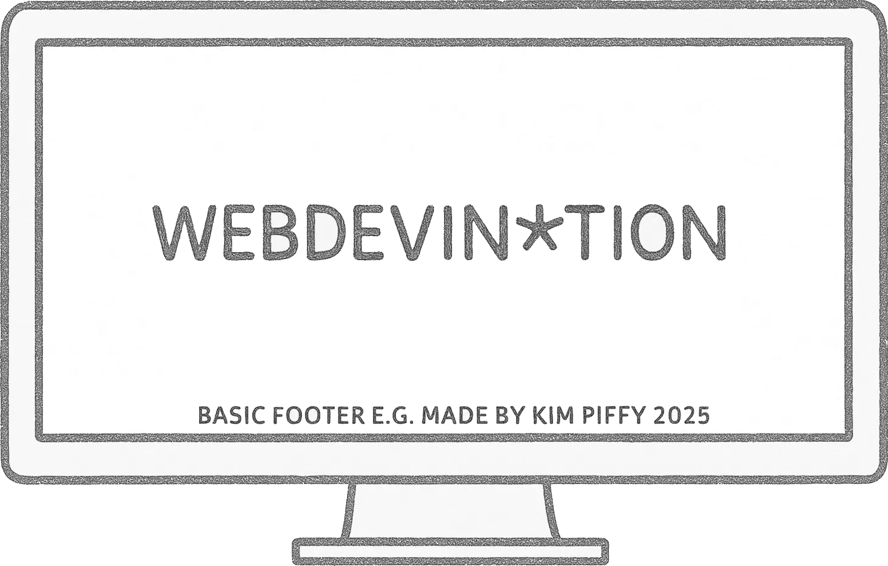 |
| 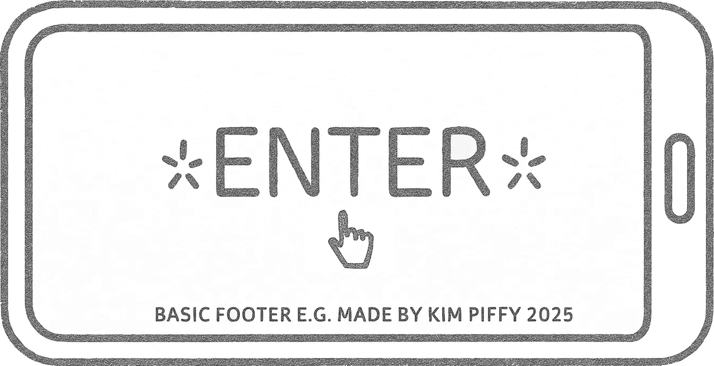 | 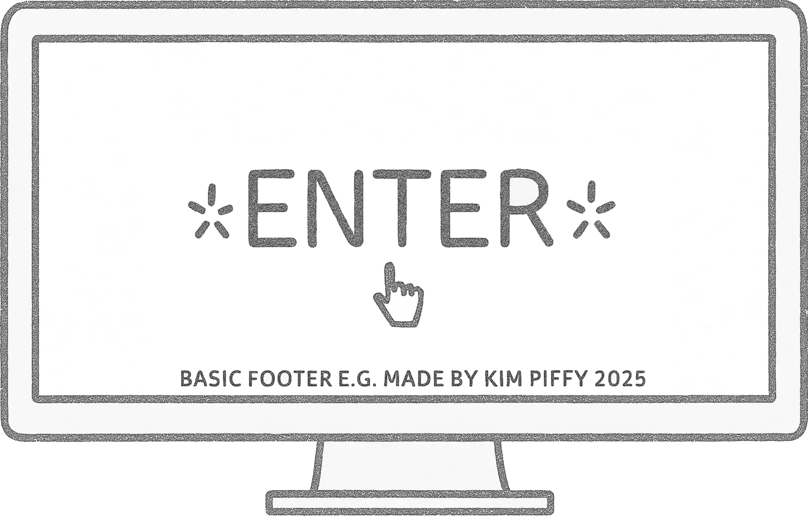 |

### 2. Info, Reading Selection & Oracle Page Wireframes (info.html)

| Mobile                                                   |   Desktop                                               |
|:----------------------------------------------------------:|:-----------------------------------------------------------:|
|  |  |

### 3. One Card Reading Page Wireframes (info.html)

| Mobile                                                   |   Desktop                                               |
|:----------------------------------------------------------:|:-----------------------------------------------------------:|
|  |  |
|  |  |
|  |  |

### 4. Three Card Reading Page Wireframe (threecard.html)

| Mobile                                                   |   Desktop                                               |
|:----------------------------------------------------------:|:-----------------------------------------------------------:|
|  |  |
|  |  |
|  |  |

### 5. Card Designs & Interpretation Supplement Page Wireframe (cards.html)

| Mobile                                                   |   Desktop                                               |
|:----------------------------------------------------------:|:-----------------------------------------------------------:|
|  |  |
|  |  |
### 6. Learn Tarot Matching Game Page (learn.html)

| Mobile                                                   |   Desktop                                               |
|:----------------------------------------------------------:|:-----------------------------------------------------------:|
|  |  |

<h3 id="9"> 2. Color Palette</h3>

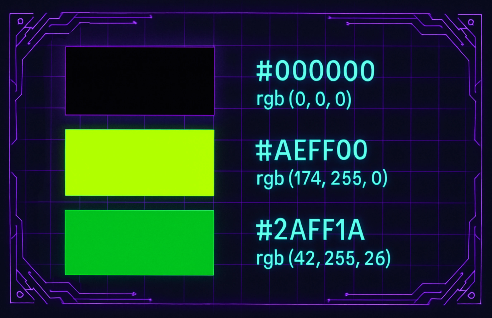

Terminal Green

#### Origins and Purpose
In the early days of computing, monochrome CRT (cathode-ray tube) monitors often displayed text in shades of green on black. This phosphorescent green was not just an aesthetic choice—it was a practical one:
CRT monitors used phosphor compounds to emit light when struck by an electron beam. The P1 phosphor, used in many displays, naturally emitted a green glow.

Readability - Green on black provided excellent contrast, reducing eye strain for prolonged periods of coding or command-line use.
Longevity - Green phosphor had a long persistence, meaning characters stayed visible slightly longer without flicker, enhancing clarity.

#### Modern Digital Terminals and Nostalgia
Even today, many digital terminal themes use shades of green on black—this is partly for readability, but largely due to nostalgic appeal. It taps into the retro-futuristic aesthetic of early hacking culture, matrix visuals, and vintage computing.

 

Webdevination's Neon Green
  

#### Artistic Reinterpretation

The chosen green ``(rgb(174, 255, 0)`` is brighter and more neon than classic terminal green. This is a subtle but impactful tweak that nods to the developer's own visual language. 
Since the card deck was generated by training midjourney with the developer's own artwork which often uses flourescent hues, this tone was also picked to coompliment the designs in the deck; bold, mystical, luminous.
Neon green feels more otherworldly than dull phosphor green. Even without a text shadow it is almost glowing - representing arcane energy, which aligns with the mystical, divinatory interface.

#### Adding Glow Through Text Shadow
The layered text-shadow:

``text-shadow: 0 0 5px #2aff1a, 0 0 10px #2aff1a, 0 0 20px #2aff1a;``

creates a radiant aura around each glyph. This emulates the soft bloom that would have been seen on CRT displays and further accentuates the "terminal meets tarot" feel:

Visual Depth - The glow give the text an extra dimension making the experience feel more tactile. 
It also adds and enchanting feel which references mystical glyphs perfect for a digital oracle/mystic experience.

<h3 id="10"> 3. Icons</h3>

A combination of icons from Google Material Icons, Font Awesome, and an Emoji have been used throughout this project. Icons have played a crucial role in solidifying the link between technology and esotericism. The landing page, info page, navbar and footer all utilize icons to enhance the design choices of the tarot site. 

For the landing page a selection of Google Material Icons were used to emphasise the connection between technology and mysticism. Below is a table showing the icons that 'flash between letters' in the landing sequence. Some of these icons were originally designed to represent ideas irrelevant to this project, but they are given new meaning in the context of divination. The table below outlines the icons used and their intended meaning within the scope of this project. 

#### Google Material Icons 

| Icon Preview | Icon Name | Description |
|--------------|-----------|-------------|
|  | `key` | Key represents access or unlocking secrets/mysteries |
|  | `blur_on` | Blurred effect represents mystical aura |
|  | `saved_search` | Saved search represents looking inwards/ personal insight |
|  | `self_improvement` | Meditation / inner growth |
|  | `paid` | Payment / Coin / Value / Suit of Pentacles|
|  | `remove_red_eye` | Visionary / Third Eye / Perception |
|  | `electric_bolt` | Energy  or Lifeforce|
|  | `emoji_events` | Trophy / achievement - represents suit of Cups|
|  | `flare` | Flare / light / sparkle / alchemy / fire |
|  | `emoji_nature` | Nature / spiritual connection |
|  | `auto_awesome` | Sparkles / magic |
|  | `public` | Globe / world - The world card |
|  | `psychology_alt` | Brain / psyche |

#### Font Awesome Icons 

  
  A custom icon was created on FontAwesome for the Navbar branding. The upright pentagram was chosen as the symbol underpins the entire metaphysical framework of the tarot. The pentagram is directly represented in The Suit of Pentacles. Its use in the branding space of the Navbar solidifies the use of web 'icons' as esoteric symbols throughout the project.
  

Font Awesome's styling utilities have aided the 'flashing' of the icon, achieved by applying `fa-fade` inside of the `i class`.

 

   
  A second icon taken directly from the FontAwesome library was used in the footer. This adds a cohesive, lighthearted and personal touch to the otherwise straightforward and minimalistic footer used across the site. 

 

#### Emoji's

Emoji's are implemented on the site as playful supplements to the UX. **Please be aware that emoji graphics will appear differently depending on the browser/operating system. Despite this the emoji's used are universal and represent the same thing despite style indescrepancies. The images below may not appear as they look here on your own browser. Users should be able to interpret them accordingly. They offer visual enhancement only and are not vital for a positive UX - they simply enhance the style choices used on this site.**

   
  The crystal ball emoji was used in the title of the [A.I oracle](webdevination.onrender.com/info.html) feature to help captivate the users attention. The color of the emoji also compliments the card designs featured on the info page and breaks up the otherwise heavy neon green and black elements.  

 
 

   
  The Mushroom emoji appears above the card selections on [info.html](webdevination.onrender.com/info.html) in the heading `tarot readings` which is shown on the users 2nd, 3rd & nth visit to the page in a session, in place of the terminal text which is shown only on their landing visit.

 
 

#### The four emoji's below reference the element's that the Minor Arcana suits correspond to. They are found inside the accordion for the Minor Arcana next to the suit titles on the [cards page](webdevination.onrender.com/cards.html).

   The flame emoji references the element of fire which corresponds to The Suit of Wands.   

   The 'sweat-drops' emoji references the element of water which corresponds to The Suit of Cups. This emoji is taken to represent water not sweat in this context.  

   The tornadoo emoji references the element of air which corresponds to The Suit of Swords.   

  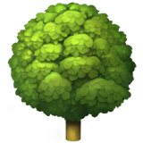 The deciduous tree emoji references the element of earth which corresponds to The Suit of Pentacles.

 
 
 

#### The three emoji's below are used in the messages displayed by the A.I oracle:

 Displays whilst the oracle is 'thinking' before the response is generated.   

   If the API returns an empty result the emoji shows with the message `"The Oracle is silent..."`.  

   If a fetch error occurs this emoji displays alongside the message `"The mists are unclear. Try again soon."`   

#### These 4 emoji's are displayed alongside the specific card info which is revealed by flipping the card images on the [cards page](webdevination.onrender.com/cards.html).

 Shows next to the "LOVE" category on card backs.   

 Shows next to the "CAREER" category on card backs.   

 Shows next to the "FINANCE" category on card backs.   
  
 Shows next to the "HEALTH" category on card backs.   
  
<h3 id="11"> 4. Fonts </h3>

Typography plays a vital role in reinforcing the aesthetic and metaphysical tone of the project. Two distinct typefaces—Tourney and Source Code Pro—were chosen to complement the terminal-style theme and enhance the user’s immersive experience.

#### Primary Font - Tourney 

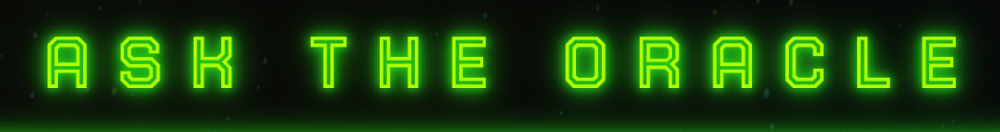

Tourney was selected and installed from the [Google Fonts Library](https://fonts.google.com/specimen/Tourney).

Tourney is a bold, futuristic display font that immediately conveys the tone of mysticism meeting modernity. It was chosen for headers and buttons because:

* It's condensed, geometric forms feel cryptic and alien —perfect for esoteric symbolism.
* The uppercase style evokes a commanding presence and ritualistic formality.
* It's synthetic, digital personality aligns with the site's techno-terminal aesthetic, making each heading feel like a cosmic interface label.
* By using Tourney on interactive elements (like buttons), the site invokes the feeling of activating a spell or accessing a sacred machine.
* Buttons using Tourney feature hover-based flash animations to clearly distinguish them from static headers.
* This visual flash, combined with a cursor pointer and a subtle `transform: scale(1,1)` effect, signals the button's interactivity and sets it apart from passive text.
* Letter-spacing is increased on both headers and buttons to enhance its glyphic, rune-like energy.
* Tourney appears in bright green tones that echo the mystic-glow palette used throughout the site.

Tourney/button example:  
  

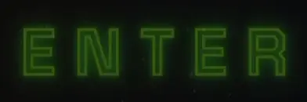

#### Secondary Font - Source Code Pro

 

Source Code Pro was selected and installed via [Google Fonts Library](https://fonts.google.com/specimen/Source+Code+Pro?query=source+code).

Source Code Pro, a monospaced font originally designed for code editors, was selected for all paragraph and informational text because:

* It evokes the aesthetic of terminal interfaces, reinforcing the site's identity as a mystical operating system or divinatory console.
* It's fixed-width spacing makes it easy to scan and consistently legible, ideal for AI responses, tooltips, card descriptions, and modal text.
* The slightly italicized variant has been implemented to create a sense of quietness — as if the user is being whispered to by the machine, or gently told their fortune by a sentient digital oracle.
* Weights 400 and 500 were selected from the Google Fonts library to strike a balance between clarity and tone—bold enough to be readable, but light enough to feel elegant.
* The fallback stack is: `font-family: 'Source Code Pro', monospace;`
* This ensures that, in the absence of the Google font, the browser defaults to any available monospaced font. This choice is intentional: terminal-style text doesn’t need embellishment—as long as it’s monospaced, it retains the intended feel of a sacred codebase.

Fallback preview: 
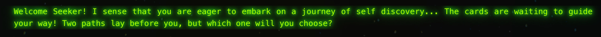

<h3 id="12"> 5. Images </h3>

The tarot deck featured throughout this project was entirely custom-made using MidJourney, with artistic direction, structure, and refinement handled manually to ensure continuity, symbolism, and visual cohesion.

#### Original Art as Style Input

* The process began by feeding MidJourney with the developer’s own neon-infused illustrations and painted works. This not only grounded the deck in a unique personal style, but also allowed MidJourney to reflect consistent textures and color palettes from the onset.
  
#### Prompt Engineering with Purpose

* Prompts were carefully refined to align with the structure and symbolism of the original Rider–Waite–Smith tarot deck. Figures, objects, and settings were all influenced by this historic reference point, preserving the archetypal and symbolic elements of each card whilst evolving the aesthetic into something futuristic and enigmatic.

#### Stylistic Cohesion

* The neon tones of the developer’s own artwork, echoed throughout the card illustrations, were intentionally designed to complement the terminal-green hue used in the site’s typography and UI. This unifies the deck with the digital interface, visually complementing the 'operating system' that surrounds the cards.

#### Hand-Crafted Typography & Borders

* After generating the artwork, every card was brought into Adobe Illustrator, where each card front was then framed with a matching border.
* Using consistent geometry and visual weight gives the deck a unified identity.
* The intricate Art Nouveau-style border work offers a psychedelic but classical edge, amplifying the mystical and ornamental feel of the deck as though each card is a sacred or mystical object.
* The neon green stroke path around the black swirls in the border matches with the neon green terminal text.

#### Custom Card Backs

* Used in 'card flips'
* Separate card back designs were created to mirror the same visual language as the fronts.
* These backs incorporate the name of the project 'WEBDEVINATION' acting as a subtle signature. The psychedelic font and pattern on the back of the cards reflect the deck’s ritualistic function and digital mystique. The green hue on the backs matches with the terminal and `text-glow` class to give synergy between the other design elements and the cards themselves.
  
#### Curation & Optimization

* Final card artwork was selected from hundreds of MidJourney iterations and lightly refined before being exported as WebP files for maximum performance online.
* Card images and descriptions are all loaded dynamically through the json file `tarot.json`

#### Symbolic Integrity

* Although visually modern, the iconography, gestures, and spatial structures of the cards remain true to the symbolic language of traditional tarot ensuring that each one still carries its archetypal resonance and interpretive power.

<h3 id="13">6. Styling</h3>

The project’s visual identity is powered by a deep interplay between handcrafted CSS and immersive JavaScript logic, working together to create a world that feels both symbolic and alive.

#### CSS Styling Highlights

* The site uses over 100 custom CSS classes to style every element. From glowing buttons and floating icons to animated card draws, modals, and game elements.
* Multiple @keyframes animations are used to bring movement and atmosphere to the page: glowing effects, blinking lights, floating sparkles, flickering text, and portal transitions.
* A carefully structured class system allows consistent styling across pages while still letting individual components (like the oracle terminal, tarot deck, or navbar) express their own unique qualities and usefulness - no feature is redundant.
* Typography, spacing, and color are tightly integrated — from mystic-green glow on buttons to soft, monospaced text on responses — ensuring that every interaction feels like part of a ritual interface.

#### JavaScript-Driven Dynamics

* JavaScript is used extensively throughout the project to bring style to life: cards are loaded, flipped, shuffled, and drawn dynamically, all with coordinated animations and responsive behaviors.
* The navbar transitions, menu highlights, and active link states are all controlled by JS to help users feel like they’re navigating a mystical interface, not just a static page.
* Across the site loading transitions, interactive prompts, and session-based effects are enhanced by JS logic, adding rhythm, feedback, and timing that pure CSS alone can't provide.
* Rather than just adding behavior, JavaScript in this project is used to amplify the aesthetic, helping the visuals pulse, breathe, and respond to the user’s presence.
* Together, the custom CSS and dynamic JavaScript form a ritualistic design language, giving the entire site a surreal, responsive quality that transforms it from a simple website into a mystical, living experience.

<h2 id="14"></h2>

<h2 id="15">Features - All Pages</h2>

<h3 id="16">1. Navbar </h3>

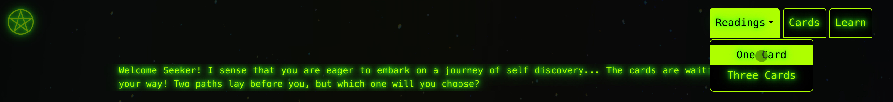

The navbar can be found on all pages apart from the landing page
It was created from a [boilerplate](https://getbootstrap.com/docs/4.0/components/navbar/) copied from Bootstrap 5 and then customized. 

  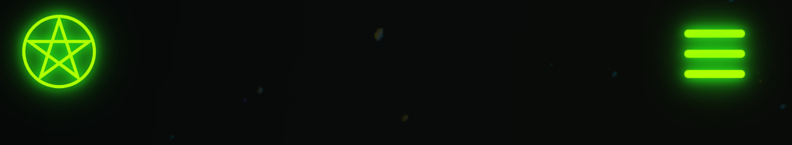

  

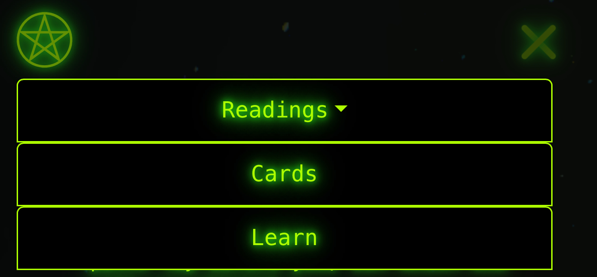

 
 
 

* Fully responsive layout using Bootstrap 5’s `navbar-expand-lg` and collapse behavior.  
* Dropdown menu under "Readings" links to the One Card and Three Card spread pages.  
* Transparent background allows visuals and text to stylishly pass through the navbar.  
* Despite the fact that on `index.html`, users are prompted to rotate their device horizontally for optimal experience — all paragraph text and headings are styled to fit within the space between the navbar brand and the hamburger icon, maintaining readability and styling both horizontally and vertically just in case a user misses the "rotate screen" prompt on the landing page.  
* Uses a custom Font Awesome pentagram icon as the brand element, referencing both the occult and the suit of Pentacles.  
* The pentagram icon links back to `index.html` and features a pulsing glow animation that mirrors button keyframe styles.  
* Custom glow effects on links (`text-glow`) enhance interactivity and mood.  
* Mobile menu transforms into a glowing X icon when toggled.  
* Utilizes a monospaced, mystic-coded style (`Source Code Pro`). |

<h3 id="17">2. Footer</h3>

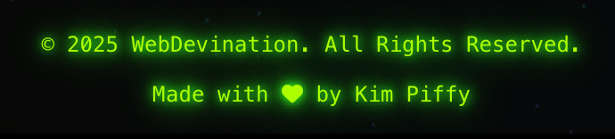

* Fixed at the bottom of every page, styled with subtle glow and low opacity text.
* Display the current year dynamically using JavaScript
* Includes the developers name and copyright
* Heart icon incorporated to match with index.html use of icons.
* Minimal styling and small font size to remain non-distracting.
* Inherits glow and font styling from global .text-glow and Source Code Pro.

<h3 id="18">3. Preloader</h3>

* Handled through nav.js - please view file for full notes.
* Fullscreen overlay that displays on initial page load.
* Portal-style animation: a glowing circle that expands on entry and contracts on exit.
* Alternates between entry/exit using JavaScript `sessionStorage` to make the user feel like they are entering and leaving the portal between each page.
* CSS animations (@keyframes) manage scaling, rotation, and opacity.
* Lightweight and optimized for fast performance across devices.
* Adds an immersive mystical "gateway" effect to the UX - enhancing the convergence between technology and mysticism. 

<h2 id="19">Features - Landing Page (index.html).</h2>

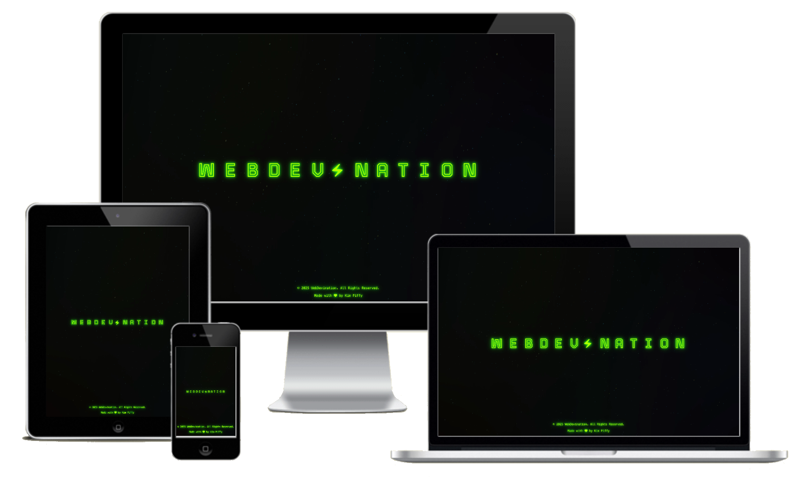

<h3 id="20">1. Text/Icon Animation</h3>

* JavaScript: Animates each letter of "WebDevination" to briefly swap into a Material Icon, then back again, creating a dynamic, futuristic intro effect.
* CSS: Custom keyframes and transitions enhance the animation for smooth sliding and opacity effects.
* HTML: Each letter and symbol is carefully structured with nested spans to allow individual animation targeting.

<h3 id="21">2. Enter Button</h3>

* JavaScript: Displays a "Enter" button after 3 animation cycles. Users can either click the button, click anywhere on the page, or press the Enter key (added enhancement) to instantly navigate to the Info page.
* UX Upgrade: The enter key press shortcut mentioned above was added to allow faster navigation for impatient users.

<h2 id="22">Features - Readings Info & A.I Oracle Page (info.html)  </h2>

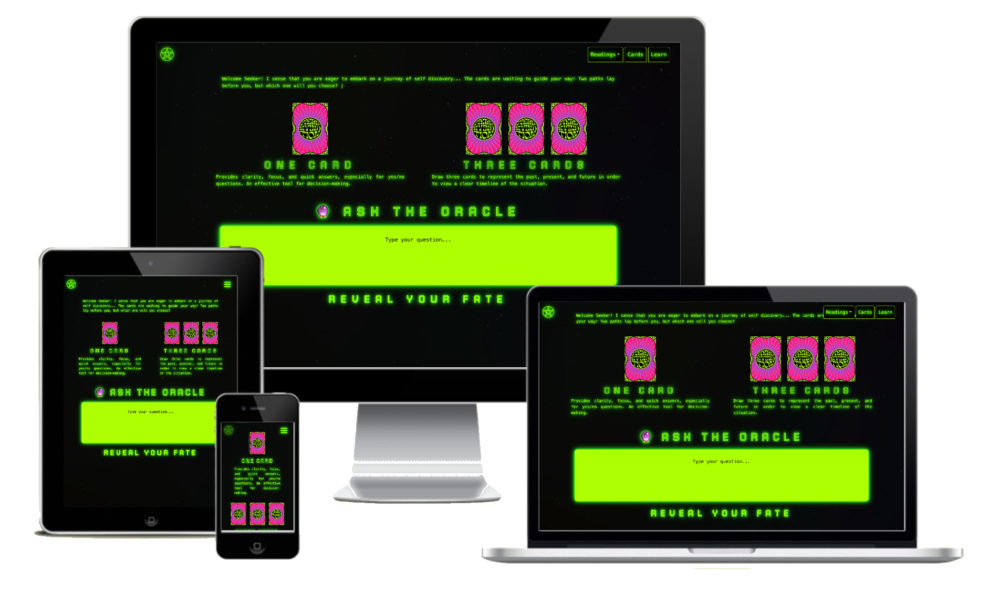

<h3 id="23">1. Terminal Typed Welcome & Skip Button</h3>

* JavaScript: Types out a multi-line introduction slowly to simulate an old-school terminal using `setTimeout.`
* Session Storage: Saves a `visitedInfoPage` flag so that after the first visit, the long typing sequence is skipped and a simple "TAROT READINGS" heading is shown instead.
* Skip Button: UX orientated feature allows users to skip typing manually on first visit if they wish.

<h3 id="24">2. Readings Selection</h3>

* JavaScript: Reveals two buttons (One Card / Three Cards) after intro text, along with animated card images and short explanations.
* CSS: Fade-in effects and animated reveals for the cardback images and reading options.

<h3 id="25">3. A.I Oracle</h3>

* JavaScript: Custom form submission captures user's question, sends it via `fetch POST` request to a `Node.js` API hosted on Render.
* OpenAI Integration: Oracle server uses real-time API calls to generate poetic, mystical responses.
* Typing Animation: Displays Oracle's answer one letter at a time for a magical feel. Shows a `"Consulting the Stars..."` interim message while fetching.
Fallback Messages:
* If no answer is returned from the API (network error, server offline, etc.), user-friendly fallback messages appear instead:
-   `"🕯️ The Oracle is silent..."` (if the API returns an empty result).
- `"🌫️ The mists are unclear. Try again soon."` (if a fetch error occurs).
* Input Locking: Disables form fields while awaiting API response to prevent duplicate submissions.

<h2 id="26">Features - Reading's Pages (onecard.html & threecard.html)</h2>

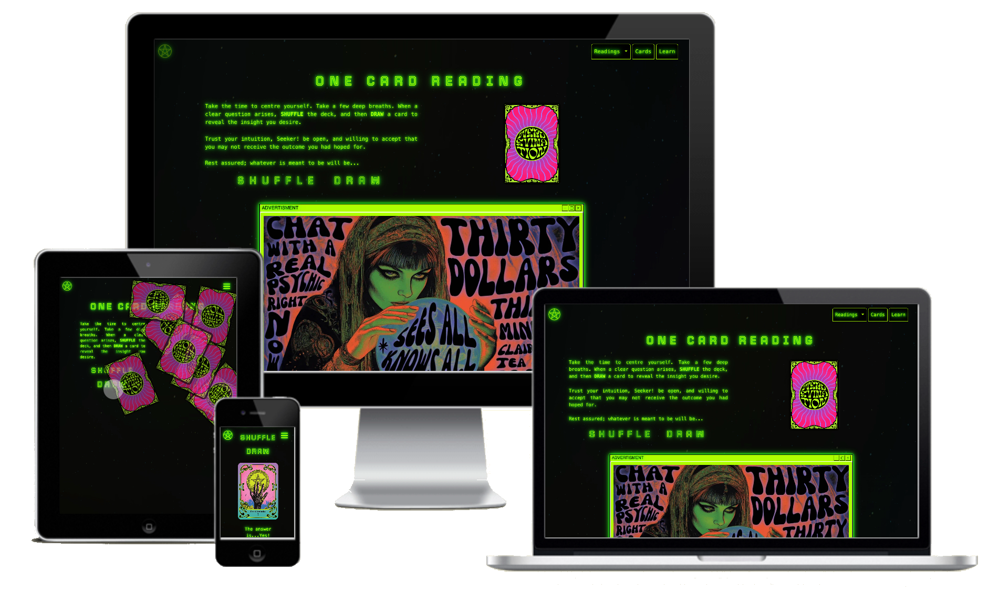
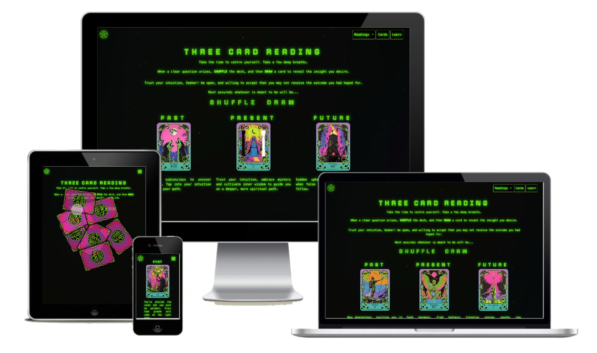

<h3 id="27">1. Shuffle Feature</h3>

* JavaScript: Shuffles the deck using the Fisher-Yates shuffle algorithm and animates the cards flying randomly for a dynamic effect. This is loaded from `utilities.js.`
* CSS: Transition effects make the cards appear to "scatter" and return. `overlay: visible` allows cards to scatter over other page elements for effective visuals. `overlay:hidden` on the body prevents this feature from adding unnessacary width/height to the page whilst the shuffle is activated. 

<h3 id="28">Draw Feature</h3>

* One Card: User selects a single card, which flips to reveal its artwork and a cryptic interpretation, both are loaded from `tarot.json`
* Three Cards: User draws past, present, and future cards, each flipping independently. Like one card each card image and it's corresponding description are loaded from the `tarot.json`
* JavaScript: Both pages have their own js file to handle the intracacies and differences of the draw logic. After the shuffle is inserted from the `utilities.js` file, `onecard.js` and `threecard.js` respectivley handle each pages draw feature. Click handlers dynamically inject the selected cards into the DOM.

<h3 id="29">Card Images & Descriptions</h3>

* JavaScript: Dynamically inserts the selected card's name, image, and description into the page after the card flip animation completes. See above. 

<h3 id="30">Modal</h3>

* JavaScript: Windows 95 mock-style neon modals pop up when the first shuffle is complete, prompting the user to select draw to load their cards. These modals are injected entirely from the js file `utilities` and iteract with `onecard.js` and `threecard.js`
* Accessibility: OK button focuses automatically inside the modal when opened.

<h3 id="31">Fake Advertisment</h3>

* HTML/CSS: A fun feature which uses reduntant/empty space on `onecard.html`. This fake advert was created using Midjourney and ProCreate. The advertising space could potentially be used for revenue and real adverts, which is the true purpose of implementing it. It shows that passive revenue could be generated from using advertisment within the sites pages. 
* Advert container is styled to match the retro/futuristic Win95 aesthetic with neon green. It houses an advert for a fake fortune teller 'Madame Electra' with a captivating animation which is both alluring and strange.  

<h2 id="32">Cards Page (cards.html)</h2>

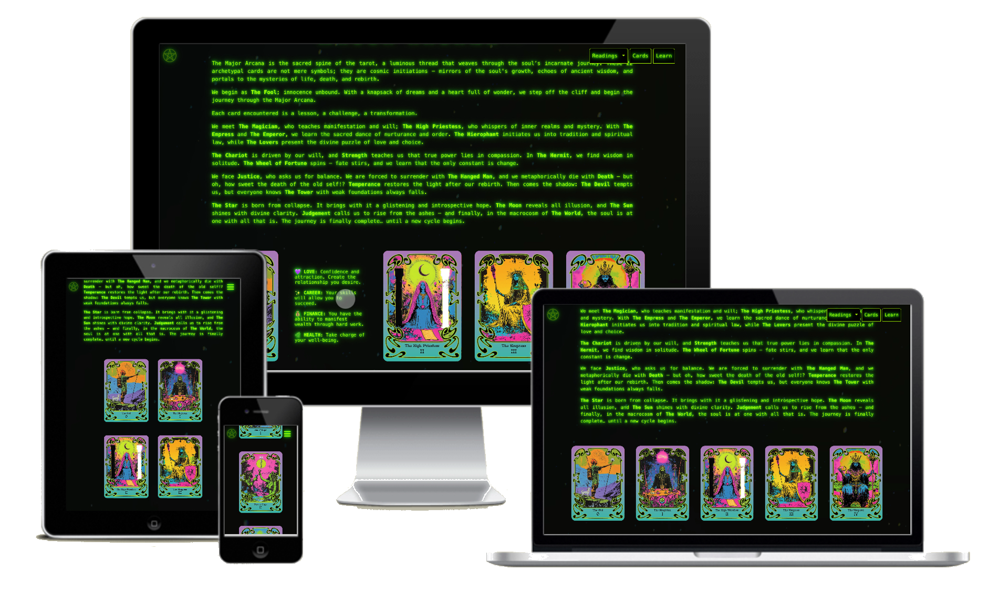

<h3 id="33">1. Card Images</h3>

* A full deck of 78 cards were generated with MidJourney. Style influences were provided with the developers own artwork, and prompts included references to the symbols on the cards which are found on the traditional Ryder-Waite deck. This page allows users to enjoy the artwork which they will have come across in their readings.
* JavaScript: Dynamically loads all 78 Tarot cards from a `tarot.json`.
* Responsive Grid: CSS flexbox/grid layout adapts based on screen size.

<h3 id="34">2. Flip Info</h3>

* JavaScript/CSS: Hovering or tapping a card flips it to show a brief description on the back using smooth  `rotateY` animations.
* These fields loaded from the `tarot.son` file are seperated from the `interpretation:` field which is loaded on the readings pages.
* `"specifics":` which loads upon flipping the card image displays short categorized information fields (`LOVE`, `CAREER`, `FINANCE` and `HEALTH`) which aim to supplement the UX and allow the user to access specific indicators which can guide them to interpret the card from their readings if they wish.

<h3 id="35">3. Suit Stories</h3>

* JavaScript: Intro stories for each suit (Wands, Cups, Swords, Pentacles) dynamically inserted when the accordion is expanded.
* These stories provide an indepth, emotive look into the cards aiming to encourage a deeper understanding of the symbolism within the tarot, supplementing the UX and inspiring the user to learn more about each card. 
  
<h2 id="36">Learn Page (learn.html)</h2>

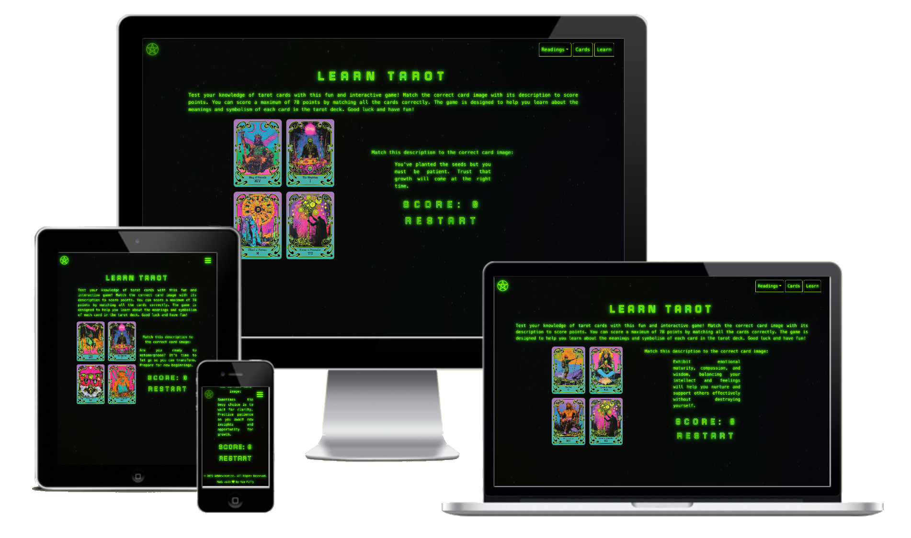

<h3 id="37">1. Multiple Choice Game</h3>

* JavaScript: Interactive quiz where the user matches the interpretation to the correct Tarot card among 4 randomized options which are loaded via `learn.js` from the `tarot.json`
* Score Keeping: Tracks user's score with a max available score of 78.
* Session State: Moves to next 4 card choice automatically after each guess whether right or wrong - user is informed via modal (see below).

<h3 id="38">2. Modal</h3>

* JavaScript: Bootstrap modals customized with Win95 aesthetic pop up after each answer.
* Audio Feedback: Plays a nostalgic Windows 95 error sound on wrong answers located at `assets\audio\win95_error.mp3` to enhance the retro game feeling and suprise the user a little.
* Accessibility: Keyboard (Enter key) shortcuts allow easy modal closure after feedback.
* Answer: Whether right or wrong, the modal text is adjusted to inform the user of the correct card, injected via the `"name":` field in `tarot.json`. 

<h2 id="39"></h2> 
<h2 id="39">Technologies Used</h2>
<h3 id="40">Languages</h3>

#### 1. HTML
The foundational markup language used to structure all pages across the site, including the Oracle, card gallery, spreads, and modals.

#### 2. CSS
Responsible for the entire visual language of the project. Custom classes were written to manage layout, color, animation, interactivity, and theming. Over 100 hand-authored classes power the site’s unique styling system.

#### 3. JavaScript
Powers dynamic behavior throughout the site. From controlling the navbar and shuffling cards to managing portal animations, dropdown logic, and Oracle input/output — JavaScript gives the site life and movement.

<h3 id="41">Frameworks</h3>

#### 1.  [Bootstrap 5](https://getbootstrap.com/)
Used as a responsive layout foundation and for components like the navbar, modals, and accordion galleries. Utility classes were also used throughout, though heavily customized to create a completely original aesthetic.

#### 2. [Express.js](https://expressjs.com/)
Provides the lightweight backend framework for the AI Oracle, handling routes, requests, and API integration.

#### 3. [Node.js](https://nodejs.org/en)
Runs the server-side logic for the Oracle, allowing API calls to OpenAI, Aztro, and Farmsense while managing environment variables and user session memory.

<h3 id="42">Libraries & APIs</h3>

#### 1. [Font Awesome](https://fontawesome.com/)
Used throughout for iconography, including social links and the custom navbar pentagram icon.

#### 2. [OpenAI API](https://openai.com/api/)
Generates poetic, symbolic responses based on user questions and astrological context.

#### 3. [Aztro API](https://aztro.readthedocs.io/)
Supplies real-time daily horoscopes based on user-provided birth date or zodiac sign.

#### 4. [Farmsense API](https://www.farmsense.net/api/)
Delivers current moon phase data to enrich the Oracle's predictions with lunar energy.

#### 5. [Google Fonts](https://fonts.google.com/)
Used to import and serve the project’s two core typefaces 'Tourney' and 'Source Code Pro'

<h3 id="43">Platforms</a>

#### 1. [Github](https://github.com)
Hosts the deployed frontend via GitHub Pages and stores the full project codebase with version control.

#### 2. [Render](https://render.com)
Hosts the backend Oracle service and allows secure management of API keys via environment variables.

#### 3. [VS Code](https://code.visualstudio.com)
The core IDE used to design, build, and test all code for both the frontend and backend.

<h3 id="44">Other Tools</a>

#### 1. [MidJourney](https://www.midjourney.com/)
AI image generation tool trained with original artwork from Kim Jevon’s portfolio. Used to generate the full tarot deck with prompts referencing Rider-Waite symbolism. it was also used to generate images for the fake fortune teller advertisment. 

#### 2. [Adobe Illustrator](https://www.adobe.com/uk/products/illustrator/ipad.html)
Used to create hand-drawn card borders, typeset labels, and design consistent backs/fronts for all 78 tarot cards.

#### 3. [To WebP](https://towebp.io/)
Converts all images to .webp format for optimized loading and sharp, high-fidelity visuals on all devices.

#### 4. [Trimmy](https://app.trimmy.io/)
Used to crop and clean the exported tarot images, ensuring perfect alignment and consistency in visual spacing.

#### 5. [Balsamiq](https://balsamiq.com)
For sketching and visualizing early wireframes and planning responsive layouts.

#### 6. [Favicon](https://favicon.io/) 
Used to generate the site’s favicon and icon manifest files.

#### 7. [Procreate](https://procreate.com/) 
Used to paint over, clean up, or manually correct MidJourney outputs — removing unwanted elements or enhancing details that the AI misinterpreted.

#### 8. [ChatGPT](https://chatgpt.com/)
Used to brainstorm, refine prompts, debug code, and provides the mystical language for the Oracle itself. 

<h2 id="55">Testing</h2>

<h3 id="56">1. About Testing</h3>

A document including a table with all tests can be found [here](TESTING.md).

* The entire site has been tested comprehensivley throughout the build. Further evidence of continuous testing can be seen throughout the [deployment history](https://github.com/kimjev-webdev/webdevination/deployments) on Github and through the extensive [Bug Log](BUGLOG.md)
* Each time a feature was added, all the pages on the site were tested to see if there was an impact.
* The site was sent to friends, family and contacts on social media  feedback and testing.
* Color contrasts have been checked to ensure compliance with WCAG guidlines.

 

    

<h3 id="57">2. Validation</h3>

The validation section of the testing document can be found [here](TESTING.md#validation)

<h3 id="58">3. Mobile & Desktop Testing</h3>

The mobile & desktop testing section of the testing document can be found [here](TESTING.md#mobiletesting)

<h3 id="59"> 4. Manual Testing</h3>

The manual testing section of the testing document can be found [here](TESTING.md#manual)

<h3 id="60"> 5. User Story Testing</h3>

The user story testing section of the testing document can be found [here](TESTING.md#user)

<h3 id="61"> 6. Bugs </h3>

A comprehensive log of all debugging actions taken throughout the project timeline can be found [here](BUGLOG.md).

There is also a list of bugs which are yet to be resolved in the [testing document](TESTING.md).

<h2 id="61a"> Deployment </h2>

The full WebDevination experience (frontend + Oracle backend) is deployed using [Render](https://render.com/).

🔮 **Live Project Link:**  
https://webdevination.onrender.com

<h3 id="61b">

### Why Deploy with Render?

Although the project frontend was initially available through GitHub Pages, GitHub Pages only supports **static files** (HTML, CSS, JS).  
It **does not support server-side APIs** meaning features like the Oracle (which relies on OpenAI and astrology APIs) could not work properly.

Render provides full backend support, allowing WebDevination to:

* Handle dynamic POST requests
* Fetch live GPT-based oracle readings
* Incorporate real-time astrology data

By deploying both frontend and backend through Render, the project offers a seamless, integrated experience.

### Free Render Plan Notice!

Because WebDevination is deployed on Render's free tier:

If the server has been inactive for a while, it may **sleep** to conserve resources.
On the first request after sleeping, **it can take up to 50 seconds** for the server to wake up and load the site.

After waking, the site runs normally.

### Step-by-Step Render Deployment Process:

### GitHub Integration:
* The developer connects the GitHub repository (kimjev-webdev/webdevination) to Render. This allows Render to pull the latest code directly from the repository whenever a new deployment is triggered. Manual deployment is also an option. 

### Creating a New Web Service:
* On Render's dashboard, the developer selects "New Web Service", chooses "Web Service", and selects the appropriate repository and branch.

### Configuring Build Settings:
* Environment: Node.js is selected.
* Build Command: npm install (installs project dependencies).
* Start Command: node server.js (or the relevant startup file to launch the Express server).

### Setting Environment Variables: 
* Sensitive keys and API URLs (such as OpenAI API keys and astrology API endpoints) are added securely in the Environment tab of the service.
* These are not pushed to GitHub but injected at runtime using process.env.

### Deployment: 
* Once configured, Render automatically builds and deploys the project.
* The frontend (HTML, CSS, JavaScript) is served by the same backend Express server, ensuring dynamic content and server-side API functionality.
* Any new commits pushed to the selected GitHub branch automatically trigger a redeployment, keeping the live site up-to-date.
* Manual deployment can be selected to ensure the current project state has been pushed, which is useful when testing the API manually.
                  
<h2 id="62">Credits</h2>

<h3 id="64">1. Copyright Notice</h3>

© 2025 Kim Jevon. All rights reserved.

The content on this website, including but not limited to text, images, graphics, designs & logos (with the exception of Instagram & LinkedIn Icon's), are the property of Kim Jevon and are protected by copyright law. Unauthorized use, reproduction, distribution, or modification of any materials from this website without the express written permission is prohibited.

<h3 id="65">2. Licence for Use</h3>

By accessing or using this website, you are granted a limited, non-exclusive, and non-transferable licence to view and use the content solely for personal, non-commercial purposes. You may not reproduce, distribute, transmit, display, or create derivative works based on any content from this website, except as permitted by the copyright owner. 

<h3 id="66">3. Permitted Uses</h3>

* You may view and download content for personal use, provided you do not remove or alter any content.
* You may share links to pages on the website, provided that proper attribution is given to the original source.

<h3 id="67">4. Prohibited Uses</h3>

* You may not use any content on this website for commercial purposes without prior written consent from Kim Jevon.
* You may not copy, reproduce, or distribute content in any manner that could infringe on the intellectual property rights of Kim Jevon.
* You may not use automated tools or bots to scrape, index, or otherwise extract content from this website.

<h3 id="68">5. Trademark</h3>

* The trademark logo displayed on this website are registered and unregistered trademarks of Kim Jevon. Nothing on this website grants any right to use any trademark without the prior written permission of the trademark owner.

<h3 id="69">6. No Warranty</h3>

* While every effort has been made to ensure the accuracy of the information provided on this website, Kim Jevon makes no representations or warranties regarding the accuracy, completeness, or reliability of any content on the site. 
* The website is provided "as is," and users access it at their own risk.

<h2 id="70">Contact<h2>

For any further information, queries & questions you can contact me directly: kimjevon.web@gmail.com
