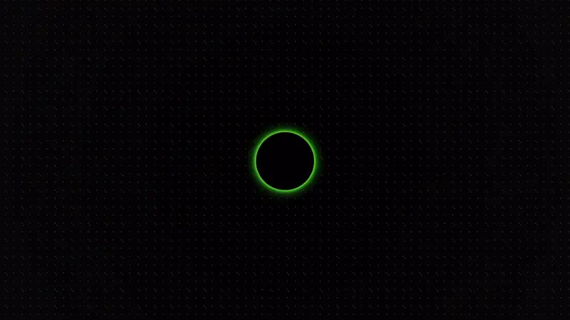

<h1 align="center"> Welcome to WebDevination </h1>

[WebDevination](http://webdevination.onrender.com/) is a portmanteau of web development and divination. This project seeks to blend the ancient art of tarot reading with the power of modern technology. The interactive tarot game is designed to offer a unique user experience that updates the divinatory experience within a digital framework.

With design influences drawn from the classic terminal interface, combined with a beautiful set of cards generated using MidJourney, the site introduces users to the concept of techno-divination which seeks to refresh and replicate the personal nature of in-person fortune telling. Javascript aids interactivity and helps to provide this authentic experience.

The single card reading, and three card reading both encourage the user to tap into their intuition and use the cards for introspective inquiry. A revolutionary 'techno oracle' powered by ChatGPT offers a unique and exciting addition to the cards, providing mysterious, metaphysical responses to the users questions. In addition to the card reading and AI oracle features, the site includes a dedicated page where users can explore the unique card designs and familiarise themselves with more specific meanings. For those wishing to learn or remember the cards, there's also an interactive game that challenges users to match card descriptions to the correct images, reinforcing their understanding in a fun and engaging way.

This project brings divination into the modern age, creating a space where the internet is justified as the perfect transcendental, immaterial environment for this practice which enables deeper connection and self-reflection.
## Table of Contents

  
<a href="#1">UX</a>

  

    
<a href="#2">Planning & Goals</a>

1.  <a href="#3">Business Goals</a>
2. <a href="#4">User Profiles</a>
3. <a href="#5">User Stories</a>
4. <a href="#6">Minimum Viable Product</a>

  

  
<a href="#7">Visual Design</a>

1. <a href="#8">Wireframes</a>
2. <a href="#9">Colour Palette</a>
3. <a href="#10">Icons</a>
4.  <a href="#11">Fonts</a>
5.  <a href="#12">Images</a>
6.  <a href="#13">Styling</a>

<a href="#14">Features</a>

<a href="#15">All Pages</a>

1. <a href="#16">Navbar</a>
2. <a href="#17">Footer</a>
3. <a href="#18">Preloader</a>

<a href="#19">Landing Page (index.html)</a>

1. <a href="#20">Text/Icon Animation</a>
2. <a href="#21">Enter Button</a>

<a href="#22">Readings Info & A.I Oracle Page (info.html)</a>

1. <a href="#23">Terminal Typed Welcome & Skip Button</a>
2. <a href="#24">Readings Selection</a>
3. <a href="#25">A.I Oracle</a>

 
  

<a href="#26">Reading's Pages (onecard.html & threecard.html)</a>

1. <a href="#27">Shuffle Feature</a>
2. <a href="#28">Draw Feature</a>
3. <a href="#29">Card Images & Descriptions</a>
4. <a href="#30">Modal</a>
5. <a href="#31">Fake Advertisment</a>

<a href="#32">Cards Page (cards.html)</a>

1. <a href="#33">Card Images</a>
2. <a href="#34">Flip Info</a>
3. <a href="#35">Suit Stories</a>

<a href="#36">Learn Page (learn.html)</a>

1. <a href="#37">Multiple Choice Game</a>
2. <a href="#38">Modal</a>

<a href="#39">Technologies Used</a>

 

<a href="#40">Languages</a>

1. <a href="#41">HTML</a>
2. <a href="#42">CSS</a>
3. <a href="#43">JavaScript</a> 

<a href="#44">Frameworks</a>

1. <a href="#45">Bootstrap 5</a>  
2. <a href="#46">Express.js</a>  
3. <a href="#47">Node.js</a>  

<a href="#38">Libraries & APIs</a>

1. <a href="#39">Font Awesome</a>  
2. <a href="#40">OpenAI API</a>  
3. <a href="#41">Aztro API</a>  
4. <a href="#42">Farmsense API</a>  

<a href="#43">Platforms</a>

1. <a href="#44">GitHub</a>  
2. <a href="#45">Render</a>  
3. <a href="#46">VS Code</a>  

<a href="#47">Other Tools</a>

1. <a href="#48">MidJourney</a>  
2. <a href="#49">Adobe Illustrator</a>  
3. <a href="#50">To WebP</a>  
4. <a href="#51">Trimmy</a>  
5. <a href="#52">Balsamiq</a>  
6. <a href="#53">Favicon Generator</a>  
7. <a href="#54">Procreate</a>  

<a href="#55">Testing</a>

1. <a href="#56">About Testing</a>
2. <a href="#57">Validation</a>
3. <a href="#58">Mobile Testing</a>
4. <a href="#59">Desktop Testing</a>
5. <a href="#60">Manual Testing</a>
6. <a href="#60a">User Story Testing</a>
7. <a href="#61">Bugs</a>

<a href="#61a">Deployment</a>

  
1. <a href="#61b">Github Deployment</a>
2. <a href="#61c">Render Deployment</a>

<a href="#62">Credits</a>

1. <a href="#64">Copyright Notice</a>
2. <a href="#65">Lisence For Use</a>
3. <a href="#66">Permitted Uses</a>
4. <a href="#67">Prohibited Uses</a>
5. <a href="#68">Trademark</a>
6. <a href="#69">No Warranty</a>

<a href="#70">Contact</a>

<h2 id="1"></h2>
<h2 id="2">UX - Planning & Goals</h2>

<h3 id="3">1. Business Goals</h3>

#### Primary Goal 
The primary objective of WebDevination is to seamlessly bring the ancient art of tarot reading into the digital age without compromising the experience. By blending modern web technology with the mystical world of divination, the site aims to create an immersive, authentic tarot experience that feels both modern and personal, guiding users through the process of self-discovery in a digital space.

#### Further business goals are:

Maintain Personal Connection

<li>Ensure that the experience of online tarot reading feels as intimate and connected as an in-person session, fostering a sense of trust and personalization for each user.</li>

 

Provide an Intuitive Experience

<li>Design the interface to be user-friendly and easy to navigate, allowing users to focus on the tarot reading itself rather than technical elements, ensuring a smooth, engaging experience.</li>

Educate, Empower, and Encourage Self-Discovery 

<li>Encourage users to learn more about tarot and their own intuition by offering educational elements alongside each reading, helping them understand the cards and their meanings in a deeper, more personal way. Foster a space that invites users to reflect, explore their emotions, and gain insights through the tarot, helping them grow personally and spiritually.</li>

Blending Aesthetics and Functionality

<li>Combine mystical tarot themes with the aesthetics of modern technology (like terminal interfaces), creating a visually appealing yet functional design that enhances the user experience without overshadowing the purpose of the site.</li>

Create a Transcendental Digital Space

<li>Offer a space where the intangible and transcendental nature of tarot can be experienced online, connecting users to both their own intuition and the ancient practice in a modern, accessible way.</li>

Promote Accessibility

<li>Ensure that the tarot experience is accessible to all users, regardless of their level of familiarity with tarot or technology, making it easy for anyone to access and enjoy.</li>

Establish an Online Presence

<li>Create a strong online presence that demonstrates technical and creative expertise, aiming to attract new opportunities and collaborations while showcasing the blend of art and web development.</li>

<h3 id="4">2. User Profiles</h3>

Experienced Pagan/Mystic

<li>A seasoned tarot practitioner seeking a digital space that maintains the sacred, intimate nature of in-person readings.</li>

Disabled Seeker

<li>A person with a disability who finds comfort and solace in tarot readings, requiring an accessible, personal online experience.</li>

Tech Enthusiast Looking for Meaning

<li>A software developer with an interest in spirituality, exploring how technology can enhance the tarot experience while maintaining its authentic essence. They are also interested in the dynamic and interactive elements on the site, it's design and functionality as well as the game itself.</li>

Folk Revival Enthusiast

<li>A person who has recently discovered tarot through the modern resurgence of interest in folk traditions, seeking a blend of contemporary spirituality and ancient practices in a digital format.</li>

Tarot Newcomer

<li>A curious individual intrigued by tarot, eager to learn and explore the practice through an intuitive and approachable platform.</li>

<h3 id="5">3. User Stories</h3>

* As an <b>experienced tarot practitioner</b>  I want the site to offer a digital tarot experience that feels as personal and sacred as an in-person reading so that I can connect deeply with the cards and trust the intuitive guidance they offer, without feeling detached from the mystic elements of the practice.
* As a <b>person with a disability who finds divination fun and accessible</b> I want the site to be easy to navigate using assistive technology, so I can experience the tarot readings in a way that feels personal, calming, and supportive, without feeling overwhelmed by design or functionality.
* As a <b> software developer with an interest in spirituality</b>  I want to interact with a tarot game that blends meaningful content with engaging, innovative design and functionality, so I can appreciate how the technical aspects of the site enhance the spiritual experience without overshadowing it.
* As <b>someone interested in the modern resurgence of folk traditions</b> I want the site to offer a contemporary approach to tarot that still maintains its roots in ancient practices, so I can experience tarot in a way that feels connected to both history and modern spirituality.
* As an <b>newcomer to tarot</b>  I want the site to provide a simple and approachable introduction to tarot, with easy-to-understand explanations and interactive features, so I can learn about tarot at my own pace and feel comfortable exploring the cards without feeling overwhelmed.

<h3 id="6">4. Minimum Viable Product</h3>

 

Responsive & Accessible Design
 
<li>Ensure the website is accessible and looks good on various devices (desktops, tablets, smartphones).</li>
<li>Implement accessibility features such as screen reader support, keyboard navigation, high-contrast mode, and adjustable text size. A simple, intuitive layout with clear navigation to make the site comfortable for users with disabilities.</li>

Navigation

<li> An easy-to-navigate menu that includes links which guide users around the site.</li>
 

 

 
Landing Page

<li>An animated and inviting landing page that helps set the 'mystic' feeling of the experience right from the start.</li>

About the Game

<li>Information that offers explination for the game and guides the user and optimises their experience before they start playing. Can be skipped.</li>

Interactive Tarot Game

<li> A basic tarot game offering a single card draw which presents answer to a yes/no question.</li>
<li> A basic tarot game offering a three card draw which provides more context about a question with cards representing past, present and future.</li>
<li> Written information about the chosen cards which supplements the user and helps them interpret their reading.</li>

Technical and Spiritual Fusion

 <li>A sleek, responsive design that reflects a balance between spirituality and modern tech, with interactive elements (such as smooth transitions when drawing cards) and clean, intuitive functionality.</li>
<li>Phosphourescent glowing green text on primarily black background to reference terminal display.</li>
<li>Unique card designs which complement the terminal aesthetic, reference the developer's artistic style and authentically connects the user to the symbolism of tarot.</li>
 

<h2 id="7">UX - Visual Design</h2>

<h3 id="8">1. Wireframes</h3>

Wireframes

### 1. Landing Page Wireframes (index.html)

| Mobile                                                   |   Desktop                                               |
|:----------------------------------------------------------:|:-----------------------------------------------------------:|
|  |  |
|  |  |

### 2. Info, Reading Selection & Oracle Page Wireframes (info.html)

| Mobile                                                   |   Desktop                                               |
|:----------------------------------------------------------:|:-----------------------------------------------------------:|
|  |  |

### 3. One Card Reading Page Wireframes (info.html)

| Mobile                                                   |   Desktop                                               |
|:----------------------------------------------------------:|:-----------------------------------------------------------:|
|  |  |
|  |  |
|  |  |

### 4. Three Card Reading Page Wireframe (threecard.html)

| Mobile                                                   |   Desktop                                               |
|:----------------------------------------------------------:|:-----------------------------------------------------------:|
|  |  |
|  |  |
|  |  |

### 5. Card Designs & Interpretation Supplement Page Wireframe (cards.html)
 
### 6. Learn Tarot Matching Game Page (learn.html)
 

<h3 id="9"> 2. Color Palette</h3>

Terminal Green

#### Origins and Purpose
In the early days of computing, monochrome CRT (cathode-ray tube) monitors often displayed text in shades of green on black. This phosphorescent green was not just an aesthetic choice—it was a practical one:
CRT monitors used phosphor compounds to emit light when struck by an electron beam. The P1 phosphor, used in many displays, naturally emitted a green glow.

Readability - Green on black provided excellent contrast, reducing eye strain for prolonged periods of coding or command-line use.
Longevity - Green phosphor had a long persistence, meaning characters stayed visible slightly longer without flicker, enhancing clarity.

#### Modern Digital Terminals and Nostalgia
Even today, many digital terminal themes use shades of green on black—this is partly for readability, but largely due to nostalgic appeal. It taps into the retro-futuristic aesthetic of early hacking culture, matrix visuals, and vintage computing.

 

Webdevination's Neon Green
  

#### Artistic Reinterpretation

The chosen green ``(rgb(174, 255, 0)`` is brighter and more neon than classic terminal green. This is a subtle but impactful tweak that nods to the developer's own visual language. 
Since the card deck was generated by training midjourney with the developer's own artwork which often uses flourescent hues, this tone was also picked to coompliment the designs in the deck; bold, mystical, luminous.
Neon green feels more otherworldly than dull phosphor green. Even without a text shadow it is almost glowing - representing arcane energy, which aligns with the mystical, divinatory interface.

#### Adding Glow Through Text Shadow
The layered text-shadow:

``text-shadow: 0 0 5px #2aff1a, 0 0 10px #2aff1a, 0 0 20px #2aff1a;``

creates a radiant aura around each glyph. This emulates the soft bloom that would have been seen on CRT displays and further accentuates the "terminal meets tarot" feel:

Visual Depth - The glow give the text an extra dimension making the experience feel more tactile. 
It also adds and enchanting feel which references mystical glyphs perfect for a digital oracle/mystic experience.

<h3 id="10"> 3. Icons</h3>

A combination of icons from Google Material Icons, Font Awesome, and an Emoji have been used throughout this project. Icons have played a crucial role in solidifying the link between technology and esotericism. The landing page, info page, navbar and footer all utilize icons to enhance the design choices of the tarot site. 

For the landing page a selection of Google Material Icons were used to emphasise the connection between technology and mysticism. Below is a table showing the icons that 'flash between letters' in the landing sequence. Some of these icons were originally designed to represent ideas irrelevant to this project, but they are given new meaning in the context of divination. The table below outlines the icons used and their intended meaning within the scope of this project. 

#### Google Material Icons 

| Icon Preview | Icon Name | Description |
|--------------|-----------|-------------|
|  | `key` | Key represents access or unlocking secrets/mysteries |
|  | `blur_on` | Blurred effect represents mystical aura |
|  | `saved_search` | Saved search represents looking inwards/ personal insight |
|  | `self_improvement` | Meditation / inner growth |
|  | `paid` | Payment / Coin / Value / Suit of Pentacles|
|  | `remove_red_eye` | Visionary / Third Eye / Perception |
|  | `electric_bolt` | Energy  or Lifeforce|
|  | `emoji_events` | Trophy / achievement - represents suit of Cups|
|  | `flare` | Flare / light / sparkle / alchemy / fire |
|  | `emoji_nature` | Nature / spiritual connection |
|  | `auto_awesome` | Sparkles / magic |
|  | `public` | Globe / world - The world card |
|  | `psychology_alt` | Brain / psyche |

#### Font Awesome Icons 

  
  A custom icon was created on FontAwesome for the Navbar branding. The upright pentagram was chosen as the symbol underpins the entire metaphysical framework of the tarot. The pentagram is directly represented in The Suit of Pentacles. Its use in the branding space of the Navbar solidifies the use of web 'icons' as esoteric symbols throughout the project.
  

Font Awesome's styling utilities have aided the 'flashing' of the icon, achieved by applying `fa-fade` inside of the `i class`.

 

   
  A second icon taken directly from the FontAwesome library was used in the footer. This adds a cohesive, lighthearted and personal touch to the otherwise straightforward and minimalistic footer used across the site. 

 

#### Emoji's

Emoji's are implemented on the site as playful supplements to the UX. 

   
  The crystal ball emoji was used in the title of the A.I oracle feature to help captivate the users attention. The color of the emoji also compliments the card designs featured on the info page and breaks up the otherwise heavy neon green and black elements.  

 

The four emoj's below reference the element's that the Minor Arcana suits correspond to. They are found inside the accordion for the Minor Arcana next to the suit titles on the 'Cards' page 
🔥💦🌪️🌳

<h3 id="11"> 4. Fonts </h3>

Typography plays a vital role in reinforcing the aesthetic and metaphysical tone of the project. Two distinct typefaces—Tourney and Source Code Pro—were chosen to complement the terminal-style theme and enhance the user’s immersive experience.

#### Primary Font - Tourney 

Tourney was selected and installed from the [Google Fonts Library](https://fonts.google.com/specimen/Tourney).

Tourney is a bold, futuristic display font that immediately conveys the tone of mysticism meeting modernity. It was chosen for headers and buttons because:

* It's condensed, geometric forms feel cryptic and alien —perfect for esoteric symbolism.
* The uppercase style evokes a commanding presence and ritualistic formality.
* It's synthetic, digital personality aligns with the site's techno-terminal aesthetic, making each heading feel like a cosmic interface label.
* By using Tourney on interactive elements (like buttons), the site invokes the feeling of activating a spell or accessing a sacred machine.
* Buttons using Tourney feature hover-based flash animations to clearly distinguish them from static headers.
* This visual flash, combined with a cursor pointer and a subtle `transform: scale(1,1)` effect, signals the button's interactivity and sets it apart from passive text.
* Letter-spacing is increased on both headers and buttons to enhance its glyphic, rune-like energy.
* Tourney appears in bright green tones that echo the mystic-glow palette used throughout the site.

#### Secondary Font - Source Code Pro

Source Code Pro was selected and installed via [Google Fonts Library](https://fonts.google.com/specimen/Source+Code+Pro?query=source+code).

Source Code Pro, a monospaced font originally designed for code editors, was selected for all paragraph and informational text because:

* It evokes the aesthetic of terminal interfaces, reinforcing the site's identity as a mystical operating system or divinatory console.
* It's fixed-width spacing makes it easy to scan and consistently legible, ideal for AI responses, tooltips, card descriptions, and modal text.
* The slightly italicized variant has been implemented to create a sense of quietness — as if the user is being whispered to by the machine, or gently told their fortune by a sentient digital oracle.
* Weights 400 and 500 were selected from the Google Fonts library to strike a balance between clarity and tone—bold enough to be readable, but light enough to feel elegant.
* The fallback stack is: `font-family: 'Source Code Pro', monospace;`
* This ensures that, in the absence of the Google font, the browser defaults to any available monospaced font. This choice is intentional: terminal-style text doesn’t need embellishment—as long as it’s monospaced, it retains the intended feel of a sacred codebase.

Fallback preview: 

<h3 id="12"> 5. Images </h3>

The images selected for the site should provide a visual overview of Kim's experience as an artist, as well as a clear idea of her visual language and style. The gallery hosts pictures of Kim's surface pattern designs and creative direction for fashion photography, her textile banners, her mixed-media artwork, art exhibitions and illustration which shows a dynamic approach to creativity.  

* Images are a combination of photographs and mockups of Kim's work which help to give a clear and concise layout to the gallery.
* 3 responsive columns are used to give a basic masonry style effect. 
* All images are high quality, and therefore have large file sizes. To aid loading times all images were compressed.
* All images are uploaded in 'webp' format to aid UX and provide superior lossless and lossy compression to the images in the gallery.
* Lazy loading (loading="lazy") was used to improve UX.
* With more time and experience the gallery would benefit from [Blur Hash](https://blurha.sh/) implementation to improve UX.
* With more time and experience the gallery would benefit from other feature such as zoom hover or displaying in larger format when clicked. 

<h3 id="13">Styling</h3>
Across the site Bootstrap 5 and Custom CSS are used interchangably to achieve the desired styles. As an absaloute beginner, the methods of achieving style results were largly trial and error and a lot of experimentation. In some cases, styling could have been achieved through Bootstrap inline, which would have saved some time, but for the sake of learning, using the custom CSS to target elements has achieved the same results and added a depth of understanding. 

<h2 id="14"></h2>

<h2 id="15">Features - All Pages</h2>

<h3 id="16">1. Navbar </h3>

The navbar can be found on all pages apart from the landing page
It was created from a [boilerplate](https://getbootstrap.com/docs/4.0/components/navbar/) copied from Bootstrap 5 and then customized. It is fully responsive thanks to Bootstrap 5’s navbar-expand-lg and collapse behavior.

|   | 
* Fully responsive layout using Bootstrap 5’s `navbar-expand-lg` and collapse behavior.  
* Dropdown menu under "Readings" links to the One Card and Three Card spread pages.  
* Transparent background allows visuals and text to stylishly pass through the navbar.  
* Despite the fact that on `index.html`, users are prompted to rotate their device horizontally for optimal experience — all paragraph text and headings are styled to fit within the space between the navbar brand and the hamburger icon, maintaining readability and styling both horizontally and vertically just in case a user misses the "rotate screen" prompt on the landing page.  
* Uses a custom Font Awesome pentagram icon as the brand element, referencing both the occult and the suit of Pentacles.  
* The pentagram icon links back to `index.html` and features a pulsing glow animation that mirrors button keyframe styles.  
* Custom glow effects on links (`text-glow`) enhance interactivity and mood.  
* Mobile menu transforms into a glowing X icon when toggled.  
* Utilizes a monospaced, mystic-coded style (`Source Code Pro`). |

<h3 id="17">2. Footer</h3>

* Fixed at the bottom of every page, styled with subtle glow and low opacity text.
* Display the current year dynamically using JavaScript
* Includes the developers name and copyright
* Heart icon incorporated to match with index.html use of icons.
* Minimal styling and small font size to remain non-distracting.
* Inherits glow and font styling from global .text-glow and Source Code Pro.

<h3 id="18">3. Preloader</h3>

*Handled through nav.js
*Fullscreen overlay that displays on initial page load.
*Portal-style animation: a glowing circle that expands on entry and contracts on exit.
*Alternates between entry/exit using JavaScript sessionStorage to make the user feel like they are entering and leaving the portal between each page.
*CSS animations (@keyframes) manage scaling, rotation, and opacity.
*Lightweight and optimized for fast performance across devices.
* Adds an immersive mystical "gateway" effect to the UX - enhancing the convergence between technology and mysticism. 

<h2 id="18">Features - Homepage</h2>

The homepage serves a strong, visually impactful set of imagery to intrigue users, with its purpose being to capture their attention and lead them 'deeper' into the website's content. 

<h3 id="19">1. Hero/Carousel</h3>

| Hero Image 1 | Hero Image 2 | Hero Image 3 |
|----------|----------|----------|
| | | |

The Hero imagery on the homepage is the first visual introduction to Kim's artwork on the site. 

* It welcomes users by providing visually exciting snapshots of 3 different artworks in different mediums.
* The first image contains green tones and binary notations to act as a visual connection between Kim's art & her web development.
* The images display in a slideshow format automatically which is aided by JavaScript and automatically switches between the images.
* The hero images in the carousel span the entire viewport width to serve an impact and give strong visual ques to the user.

<h3 id="20">2. Image Text & Overlay</h3>

The image text on the carousel 'teases' more information about the content of the website and supports the content of the hero imagery in the carousel. 

* The minimum amount of text possible is used on the homepage so that the images remain the point of focus. 
* The text that is provided "From a world of art into a new digital realm" aims to entice the user and lead them intuitivley through the site to the about page where all the information they need to comprehend the website purpose is found. The slogan 'hooks in' the user and encourages them to spend more time finding out what will happen next.
* The minimal text also adds to the aesthetic nature of the site. 
* The image text is in webp image format to help style the text in a justified format with multiple text sizes on each line. 
* The text is responsive, on mobiles it is in a box shape format to work with the vertical profile, and on larger screens it is in a longer line to give visual appeal the horizontally wider dimensions. 
* The image text is styles in Rumei House
* The button below the image text is also in Rumei House font.
* The text for the button is smaller and on rollover and click it shows a purple color.
* The text on the button 'Learn More' indicates to the users that it can be clicked to navigate to another page. 
* The button navigates to the 'About' page - the first page in the navigation to guide users through the site.
* There is a semi transparent, dark overlay which makes the text more distinguishable.
* The overlay is permenant on handheld devices to aid the user experience as there is no mouse to hover the users on mobiles will be relying on touch. 
* The overlay is activated by hovering over the hero images on desktops as the using a mouse allows for this. 

<h2 id="21">Features - About Page</h2>

The [about](https://kimjev-webdev.github.io/Unit1/about.html) page features a visually enticing responsive design which forms a single column on mobiles, expanding to two columns on tablets and on larger screens it reveals a hidden third column.

<h3 id="22">1. Images</h3>

* There are 3 images on the About page - 2 show on devices up to size medium, and 3 showing on larger screens.
* Two images show text and follow the same format as the justified text seen on the carousel overlay for consistency.
* For the same reasons images of text were used rather than text (justification issues).
* The first image displays the text 'My name is Kim' which acts as a visual introduction to the information in the following paragraph.
* The second image, the profile image, gives a personal touch to the text information, supporting the friendly and relaxed introduction in the first image.
* The profile image displays a variety of violet hues and a pattern in a flower shaped border which ties together the stylistic elements used across the entire site. 
* The final image only displays on larger screens and helps the content of the first two columns on the page look more aesthetically pleasing. It says 'its great to meet you' which again, adds personality and friendly tones to the information which could otherwise be quite serious and mundane. 
* The images with text use Rumei House, justified to fit into the widths of the container they occupy. Key words are highlighted in the mid purple tone #9256f6 which helps draw the users eyes to the most important words 'Kim & Great' - which gives a positive message about her to potential employers and collaborators. 

<h3 id="23">2. Paragraphs</h3>

* The first paragraph serves to inform users a little more about Kim's aspirations in becoming a web developer and why her artistic background is a good device for this career change. This paragraph serves the main business objective and is targetted at the key user group.
* The second paragraph adds a little more in depth information about Kim's artwork, as she does not have a web development portfolio yet it aims to express her strengths and invite users to learn more about her creative skills. It targets other users who are less crucial than potential employers or recruiters. 

<h3 id="24">3. Buttons</h3>

* The buttons help assist the user in gaining more relevant information, if the content of the paragraphs is of interest to them.
* At the base of the first paragraph is the button 'Download C.V' which provides a direct download to a PDF which will give recruiters and employers more in depth proffesional information about Kim
* This downloadable C.V prevents the about page from looking cluttered, and also allows the information to only be provided to people who require it.
* The button at the base of the second paragraph helps guide users to the next page in the navigation 'Gallery' - it says 'View my Artwork' and helps users follow a natural progression - once they have 'got to know' Kim on the about page, they can see a lot more visual information about her in the gallery. 
* Buttons utilize the darker violet #5f18ea on rollover to maintain WCAG on the white background of the about page. 

<h2 id="25">Features - Gallery</h2>

<h3 id="26">1. Images</h3>

Images in the gallery aim to showcase Kim's experiences as an artist, showcasing her dynamic design skills and justifying the stylistic choices made for the web design of her portfolio. The gallery is the anchoring point of the site which acts as a portfolio whilst Kim works on building a web-development project collection which can be added to this site at a later date.

* Images in the gallery are presented in a single column on small screens, and expand into 3 columns on larger screens.
* In order to mimic a masonry style gallery without JavaScript implementation images with 4:5 aspect ratio occupy the outside columns, whilst images with a 5:4 ration occupy the middle column. 
* Images have been resized to a maximum width of 800 pixels, as there is no way of 'zooming in' on them, they take up the width of an average phone screen whilst assisting in loading times.
* Nearly all images use 'lady-loading' with the exception of the top two images on the gallery to aid performance.
 
<h3 id="27">2. Icons</h3>

* A single icon is used on the gallery page - an up arrow, which aims to help users navigate back to the top of the gallery once they reach the bottom. 
* This arrow is a secondary option to the fixed-top navigation, should the user want to look back through the gallery rather than navigate to a different page. 

<h2 id="28">Features - Contact Page</h2>

<h3 id="29">1. Background Image</h3>

The background image is the final visual 'wow' that aims to ensure website users want to reach out and connect with Kim.

* The background image of the Contact page is a segment of one of Kim's surface patterns designs.
* The background image design is also featured in some of the 'petals' surrounding the profile photo on the about page.
* The image has been selected due to its complimentary tones that work well with the violet hues used for rollovers and buttons.
* The background image provides more visually exciting content which elevates the simple form layout on the page.

<h3 id="30">2. Form</h3>

* The form has a large scale header in Rumei House font which gives it a design contingency between the other pages.
* The form uses a semi-transparent, dark background to give synergy between the overlay used on the index page. 
* The form has curved corners to match with the images in the gallery before it. 
* The form is designed to help users be specific about their enquiry, so at a later date these inquiries can be answered in order of relevance. (Users can select the nature of the query from a drop down list)
* The form has some required fields and others that are optional. The basic requirement for the form submission is just name and email - this gives Kim the option to respond to those who have left their contact details without any extra information. This gives the minimum viable information whilst meaning the form can be submitted in the least time consuming manner if the user wishes too. This helps gain leads for employment and collaboration as it is time saving for the user. 
* JavaScript has been implimented so that on form submission a secondary window appears which includes Kim's direct email should the user want to reach out in more detail.
* The language used in headers 'Get in touch' and 'Speak Soon' aims to inform users but also maintain the relaxed communication that is used in headers on the about page. 

<h2 id="31"></h2> 
<h2 id="32">Technologies Used - Languages</h2> 

<h3 id="33">1. HTML</h3>
* This is the page markup language used.

<h3 id="34">2. CSS</h3>
* This is used for styling the elements.

<h3 id="35">3. JavaScript</h3>
* Simple JS instructions are used on the forms in the footer and on the [contact](contact.html) page.

<h2 id="36">Technologies Used - Framework</h2>

<h3 id="37"></h3>

### 1. [Bootstrap 5](https://getbootstrap.com/)
* Bootstrap 5 boilerplate code was implemented throughout the site as a blueprint for many of the elements.

<h2 id="38">Technologies Used - Libraries</h2>

<h3 id="39"></h3>

### 1. [Google Fonts](https://fonts.google.com/)
* Google Fonts was utilized for installing the Montserrat body/secondary font.

<h3 id="40"></h3>

### 2. [Font Awesome](https://fontawesome.com/)
* Font Awesome was utlized for installing icons and also used for hosting custom icons. 

<h2 id="41">Technologies Used - Platforms</h2>

<h3 id="42"></h3>

### 1. [Github](https://github.com)
* Hosts the deployed version of the site and also stores the code. 

<h3 id="43"></h2>

### 2. [Gitpod](https://www.gitpod.io/)
* Hosts the IDE used for the project development.

<h2 id="44">Technologies Used - Other Tools</h2>

<h3 id="45"></h3>

### 1. [MidJourney](https://www.midjourney.com/)
* A.I  trained  with [portfolio images](https://kimjev-webdev.github.io/kimjevon/gallery.html) from the gallery on Kim Jevon's Portfolio site. These images provided style references. Prompts were written with symbols derived from the traditional [Rider-Waite tarot deck](https://en.wikipedia.org/wiki/Rider%E2%80%93Waite_Tarot).

<h3 id="46"></h3>

### 2. [Adobe Illustrator](https://www.adobe.com/uk/products/illustrator/ipad.html)
* The iPad application was used to create card borders, backs and other graphic elements.

<h3 id="47"></h3>

### 3. [To WebP](https://towebp.io/)
* Used to convert all images to webp format.

<h3 id="48"></h3>

### 4. [Trimmy](https://app.trimmy.io/)
* Used to remove white/empty space from around the card designs after exporting from Adobe Illustrator. 

<h3 id="49"></h3>

### 5. [Balsamiq](https://balsamiq.com)
* Used to create wireframes.

<h3 id="50"></h3>

### 6. [Favicon](https://favicon.io/) 
* Used to create the websites Favicon files.

<h3 id="51"></h3>

### 7. [Procreate](https://procreate.com/) 
* Used to remove and alter elements on the MidJourney generated designs. e.g where the A.I has misread a prompt and added extra coins/cups to the design. e.g where the a.i had added in aesthetically unwanted elements which needed to be removed. 

<h3 id="52"></h3>

### 8. [Chat GPT](https://LINK) 
* WRITE HERE

<h3 id="53"></h3>

### 9. [NAME](https://LINK) 
* WRITE HERE

<h3 id="54"></h3>

### 10. [NAME](https://LINK) 
* WRITE HERE

<h3 id="54a"></h3>

### 11. [NAME](https://LINK) 
* WRITE HERE

<h2 id="55">Testing</h2>

<h3 id="56">1. About Testing</h3>

A document including a table with all tests can be found [here](TESTING.md).

* The entire site has been tested comprehensivley throughout the build. Further evidence of continuous testing can be seen throughout the [deployment history](https://github.com/kimjev-webdev/Unit1/deployments) on Github. 
* Each time a feature was added, all the pages on the site were tested to see if there was an impact.
* The site was sent to friends, family and contacts on social media  feedback and testing.
* The images in the gallery have been compressed so they are all below 300kb with an average image size of less than 150kb. 
* Color contrasts have been checked to ensure compliance with WCAG guidlines.

<h3 id="57">2. Validation</h3>

The validation section of the testing document can be found [here](TESTING.md#validation)

<h3 id="58">3. Mobile Testing</h3>

The mobile testing section of the testing document can be found [here](TESTING.md#mobiletesting)

<h3 id="59"> 4. Desktop Testing</h3>

The desktop testing section of the testing document can be found [here](TESTING.md#desktoptesting)

<h3 id="60"> 5. Manual Testing</h3>

The manual testing section of the testing document can be found [here](TESTING.md#manual)

<h3 id="60a"> 6. User Story Testing</h3>

The user story testing section of the testing document can be found [here](TESTING.md#user)

<h3 id="61"> 7. Bugs </h3>

A comprehensive log of all debugging actions taken throughout the project timeline can be found [here](BUGLOG.md).

<h2 id="61a"> Deployment </h2>

<h3 id="61b"> 1. Github Deployment </h3>

Github Pages works withh repositories that contain static files. 

The website is publicly accessible via this URL: https://kimjev-webdev.github.io/kimjevon/.

The instructions to deploy the project via Github Pages are as follows:

1. Go to the **Settings** tab in your repository.
2. Select **Pages** from the sidebar.
3. In the **Source** dropdown, select the **main** branch.
4. In the next drop down, keep **/root** as the default option.
5. Click **Save.**
6. Wait 2-3 minutes for the project to go live.

*To add a custom domain, purchase one from an external provider and enter it in the box at the bottom of the page.*

<h2 id="62">Credits</h2>

<h3 id="64">1. Copyright Notice</h3>

© 2025 Kim Jevon. All rights reserved.

The content on this website, including but not limited to text, images, graphics, designs & logos (with the exception of Instagram & LinkedIn Icon's), are the property of Kim Jevon and are protected by copyright law. Unauthorized use, reproduction, distribution, or modification of any materials from this website without the express written permission is prohibited.

<h3 id="65">2. Licence for Use</h3>

By accessing or using this website, you are granted a limited, non-exclusive, and non-transferable licence to view and use the content solely for personal, non-commercial purposes. You may not reproduce, distribute, transmit, display, or create derivative works based on any content from this website, except as permitted by the copyright owner. 

<h3 id="66">3. Permitted Uses</h3>

* You may view and download content for personal use, provided you do not remove or alter any content.
* You may share links to pages on the website, provided that proper attribution is given to the original source.

<h3 id="67">4. Prohibited Uses</h3>

* You may not use any content on this website for commercial purposes without prior written consent from Kim Jevon.
* You may not copy, reproduce, or distribute content in any manner that could infringe on the intellectual property rights of Kim Jevon.
* You may not use automated tools or bots to scrape, index, or otherwise extract content from this website.

<h3 id="68">5. Trademark</h3>

* The trademark logo displayed on this website are registered and unregistered trademarks of Kim Jevon. Nothing on this website grants any right to use any trademark without the prior written permission of the trademark owner.

<h3 id="69">6. No Warranty</h3>

* While every effort has been made to ensure the accuracy of the information provided on this website, Kim Jevon makes no representations or warranties regarding the accuracy, completeness, or reliability of any content on the site. 
* The website is provided "as is," and users access it at their own risk.

<h2 id="70">Contact<h2>

For any further information, queries & questions you can contact me directly: kimjevon.web@gmail.com
