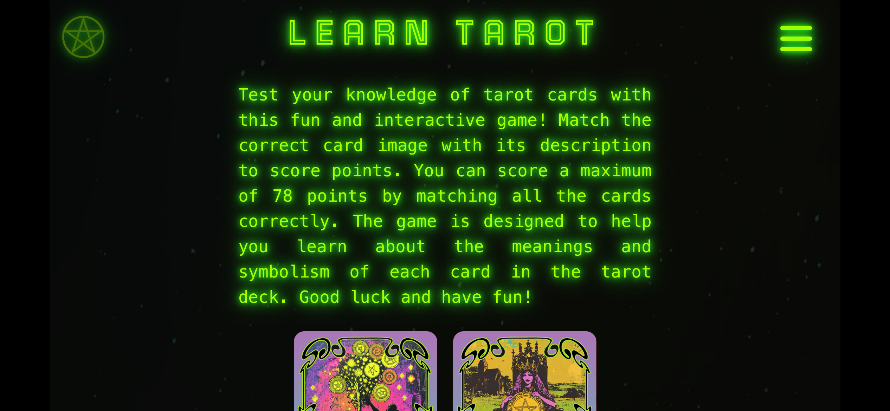
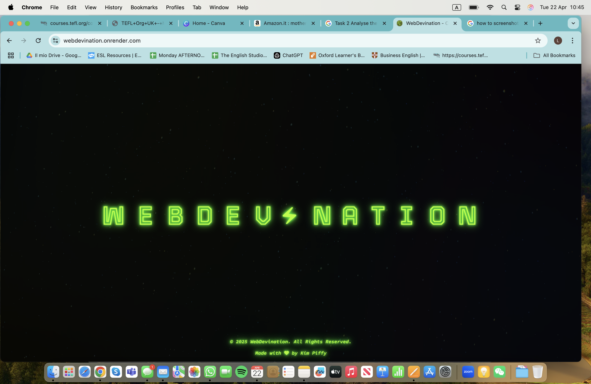
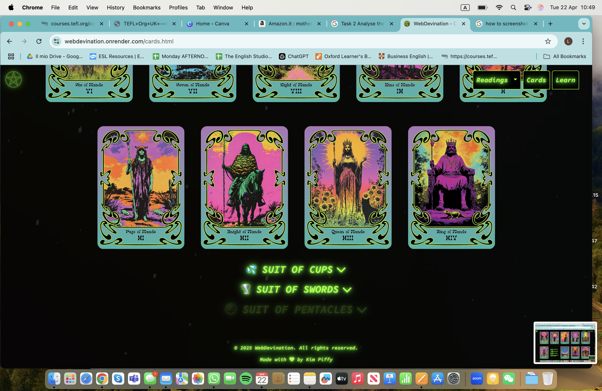

<h2 id="validation">Validation</h2>

### 1. HTML

 HTML has been validated with W3C HTML5 Validator.

| Page      | URL                  | Screenshot           | Notes              |
|-----------|----------------------|----------------------|--------------------|
| index.html     | [W3C ](https://validator.w3.org/) |  | PASSED   |
| info.html   | [W3C](https:/validator.w3.org) |   | PASSED   |
| onecard.html   | [W3C](https://validator.w3.org/) | | PASSED |
| threecard.html  | [W3C](https://validator.w3.org/) | | PASSED |
| cards.html   | [W3C](https://validator.w3.org/) | | PASSED |
| learn.html  | [W3C](https://validator.w3.org/) |  | PASSED |
| 404.html   | [W3C](https://validator.w3.org/) |  | PASSED |

### 2. CSS 

CSS has been validated with [W3C CSS Validator](https://jigsaw.w3.org/css-validator/)

| Page      | URL                  | Screenshot           | Notes              |
|-----------|----------------------|----------------------|--------------------|
| All Pages    | [W3C ](https://jigsaw.w3.org/css-validator/) |  | PASSED | 

### 3. Link Testing

Links checked with [W3C Link Checker](https://validator.w3.org/checklink).

| Page      | URL                  | Screenshot           | Notes              |
|-----------|----------------------|----------------------|--------------------|
| All Pages   | [W3C ](https://validator.w3.org/checklink) |  | PASSED |

### 4. JavaScript 
JavaScript files checked with [JSHint](https://jshint.com/).

| Page      | URL                  | Screenshot                                  | Notes              |
|-----------|----------------------|---------------------------------------------|--------------------|
| index.js   | [JSHint](https://jshint.com/) |  | PASSED |
| nav.js  | [JSHint](https://jshint.com/) |  | PASSED |
| info.js  | [JSHint](https://jshint.com/) |  | PASSED |
| oracle.js  | [JSHint](https://jshint.com/) |  | PASSED |
| server.js  | [JSHint](https://jshint.com/) |  | JSHint does not fully recognize "type": "module" settings and incorrectly flags valid module code. The import.meta warning is a false positive from the linter and does not affect functionality, testing, or production deployment. |
| onecard.js  | [JSHint](https://jshint.com/) |  | PASSED |
| threecard.js  | [JSHint](https://jshint.com/) |  | PASSED |
| utilities.js  | [JSHint](https://jshint.com/) |  | PASSED |
| cards.js  | [JSHint](https://jshint.com/) |  | PASSED |
| learn.js  | [JSHint](https://jshint.com/) |  | PASSED |

<h2 id="mobiletesting">Mobile & Desktop Testing</h2>
<h2 id="desktoptesting" style="display:none;">Lighthouse Testing</h2>

## 1. Lighthouse

Preliminary mobile & desktop testing is undertaken with Chrome dev tools Lighthouse. This assesses the pages Performance, Accessibility, Best Practices and SEO

| Page      |  Screenshot                   | Notes              |
|-----------|----------------------------------|--------------------|
index.html - Mobile     |  |GOOD SCORES |
index.html - Desktop    |  |GOOD SCORES|
info.html - Mobile      |  |GOOD SCORES |
info.html - Desktop     |  | GOOD SCORES | 
onecard.html - Mobile   |  | GOOD SCORES | 
onecard.html - Desktop  |  | GOOD SCORES |
threecard.html - Mobile |  | GOOD SCORES |
threecard.html - Desktop|  | GOOD SCORES |
cards.html - Mobile     |  |GOOD SCORES |
cards.html - Desktop    |  |GOOD SCORES |
learn.html - Mobile     |  |GOOD SCORES |
learn.html - Desktop    |  | GOOD SCORES |
404.html - Mobile       |  | GOOD SCORES |
404.html - Desktop      |  | GOOD SCORES | 

<h2 id="accessibility">Accessibility</h2>

## 1. WAVE

More detailed accessibility testing was undertaken using [WAVE](https://wave.webaim.org/) - Web accessibility evaluation tool.

| Page         | URL                             | Screenshot                                              | Notes              |
|--------------|----------------------------------|---------------------------------------------------------|--------------------|
| index.html   | [WAVE](https://wave.webaim.org/) |  | NO ERRORS |
| info.html    | [WAVE](https://wave.webaim.org/) |  | NO ERRORS - alerts for `text-align: justify` and redundant links ignored for styling purposes. |
| onecard.html | [WAVE](https://wave.webaim.org/) |  | NO ERRORS - 2 alerts for `text-align: justify` ignored for styling purposes. |
| threecard.html | [WAVE](https://wave.webaim.org/) |  | NO ERRORS |
| cards.html   | [WAVE](https://wave.webaim.org/) |   | NO ERRORS - 32 alerts for `text-align: justify` ignored - justified text chosen for stylistic reasons, only heavy use on this page. Does not effect readability. |
| learn.html   | [WAVE](https://wave.webaim.org/) |  | NO ERRORS - 2 alerts for `text-align: justify` ignored for styling purposes.|
| 404.html     | [WAVE](https://wave.webaim.org/) |  | NO ERRORS |

 

Evidence to support the readability and accessibility of the colour scheme is provided by [WebAim Contrast Checker](https://webaim.org/resources/contrastchecker/):

<h2 id="manual">Manual Testing</h2>

The site has been tested across a wide variety of devices to offer a detailed snapshot of the User Experience and iron out any final issues. Users were directed to the site and asked to send screenshots of each page. The users were also asked to report any issues they had with the site. 

## 1. Mobile
Initial mobile user feedback was unanimous: viewer preferences for viewing site in portrait on phone screens was taken into account and rotate prompt icon was subsequently removed from the index.html footer. A bug caused by double clicking the 'REVEAL YOUR FATE' button beneath Oracle more than once whilst the API was generating a response, was also flagged. JS was updated in order to remove the bug. 

| Device/Browser | Page | Screenshots | Notes |
|---|---|---|---|
| Google Pixel 6 Pro - Chrome | index.html |   | USER SUGGESTION - PREFERANCE FOR VIEWING IN PORTRAIT ORIENTATION - RECCOMENDS SWAPPING - ACTION TAKEN: REMOVED ROTATE SCREEN PROMPT ON INDEX.HTML - WILL MANUALLY TEST IN PORTRAIT ON PHONES. |
| Google Pixel 6 Pro - Chrome | info.html |   | USER SUGGESTION - PREFERANCE FOR VIEWING IN PORTRAIT ORIENTATION - RECCOMENDS SWAPPING - ACTION TAKEN: REMOVED ROTATE SCREEN PROMPT ON INDEX.HTML - WILL MANUALLY TEST IN PORTRAIT ON PHONES. |
| Google Pixel 6 Pro - Chrome | onecard.html |  | USER SUGGESTION - PREFERANCE FOR VIEWING IN PORTRAIT ORIENTATION - RECCOMENDS SWAPPING - ACTION TAKEN: REMOVED ROTATE SCREEN PROMPT ON INDEX.HTML - WILL MANUALLY TEST IN PORTRAIT ON PHONES.|
| Google Pixel 6 Pro - Chrome | threecard.html |  | USER SUGGESTION - PREFERANCE FOR VIEWING IN PORTRAIT ORIENTATION - RECCOMENDS SWAPPING - ACTION TAKEN: REMOVED ROTATE SCREEN PROMPT ON INDEX.HTML - WILL MANUALLY TEST IN PORTRAIT ON PHONES. |
| Google Pixel 6 Pro - Chrome | cards.html |   | USER SUGGESTION - PREFERANCE FOR VIEWING IN PORTRAIT ORIENTATION - RECCOMENDS SWAPPING - ACTION TAKEN: REMOVED ROTATE SCREEN PROMPT ON INDEX.HTML - WILL MANUALLY TEST IN PORTRAIT ON PHONES. |
| Google Pixel 6 Pro - Chrome | learn.html |   | USER SUGGESTION - PREFERANCE FOR VIEWING IN PORTRAIT ORIENTATION - RECCOMENDS SWAPPING - ACTION TAKEN: REMOVED ROTATE SCREEN PROMPT ON INDEX.HTML - WILL MANUALLY TEST IN PORTRAIT ON PHONES. |
| iPhone 13 - Safari | index.html |   | USER SUGGESTION - PREFERANCE FOR VIEWING IN PORTRAIT ORIENTATION - RECCOMENDS SWAPPING - ACTION TAKEN: REMOVED ROTATE SCREEN PROMPT ON INDEX.HTML - WILL MANUALLY TEST IN PORTRAIT ON PHONES. USER ALSO FLAGGED 'SCRAMBLED TEXT BUG' ON ORACLE RESPONSE - JS UPDATED TO PREVENT MULTIPLE BUTTON CLICKS BEFORE ORACLE HAS FINISHED TYPING RESPONSE. |
| iPhone 13 - Safari | info.html |     | USER SUGGESTION - PREFERANCE FOR VIEWING IN PORTRAIT ORIENTATION - RECCOMENDS SWAPPING - ACTION TAKEN: REMOVED ROTATE SCREEN PROMPT ON INDEX.HTML - WILL MANUALLY TEST IN PORTRAIT ON PHONES. USER ALSO FLAGGED 'SCRAMBLED TEXT BUG' ON ORACLE RESPONSE - JS UPDATED TO PREVENT MULTIPLE BUTTON CLICKS BEFORE ORACLE HAS FINISHED TYPING RESPONSE. |
| iPhone 13 - Safari | onecard.html |     | USER SUGGESTION - PREFERANCE FOR VIEWING IN PORTRAIT ORIENTATION - RECCOMENDS SWAPPING - ACTION TAKEN: REMOVED ROTATE SCREEN PROMPT ON INDEX.HTML - WILL MANUALLY TEST IN PORTRAIT ON PHONES. USER ALSO FLAGGED 'SCRAMBLED TEXT BUG' ON ORACLE RESPONSE - JS UPDATED TO PREVENT MULTIPLE BUTTON CLICKS BEFORE ORACLE HAS FINISHED TYPING RESPONSE.|
| iPhone 13 - Safari | threecard.html |        | USER SUGGESTION - PREFERANCE FOR VIEWING IN PORTRAIT ORIENTATION - RECCOMENDS SWAPPING - ACTION TAKEN: REMOVED ROTATE SCREEN PROMPT ON INDEX.HTML - WILL MANUALLY TEST IN PORTRAIT ON PHONES. USER ALSO FLAGGED 'SCRAMBLED TEXT BUG' ON ORACLE RESPONSE - JS UPDATED TO PREVENT MULTIPLE BUTTON CLICKS BEFORE ORACLE HAS FINISHED TYPING RESPONSE.  |
| iPhone 13 - Safari | cards.html |   | USER SUGGESTION - PREFERANCE FOR VIEWING IN PORTRAIT ORIENTATION - RECCOMENDS SWAPPING - ACTION TAKEN: REMOVED ROTATE SCREEN PROMPT ON INDEX.HTML - WILL MANUALLY TEST IN PORTRAIT ON PHONES. USER ALSO FLAGGED 'SCRAMBLED TEXT BUG' ON ORACLE RESPONSE - JS UPDATED TO PREVENT MULTIPLE BUTTON CLICKS BEFORE ORACLE HAS FINISHED TYPING RESPONSE. |
| iPhone 13 - Safari | learn.html |    | USER SUGGESTION - PREFERANCE FOR VIEWING IN PORTRAIT ORIENTATION - RECCOMENDS SWAPPING - ACTION TAKEN: REMOVED ROTATE SCREEN PROMPT ON INDEX.HTML - WILL MANUALLY TEST IN PORTRAIT ON PHONES. |
| iPhone 13 Pro - Safari    | index.html   |   | NO ISSUES REPORTED |
| iPhone 13 Pro - Safari    | info.html    |    | NO ISSUES REPORTED |
| iPhone 13 Pro - Safari    | onecard.html |       | NO ISSUES REPORTED |
| iPhone 13 Pro - Safari    | threecard.html |         | NO ISSUES REPORTED |
| iPhone 13 Pro - Safari    | cards.html   |      | NO ISSUES REPORTED |
| iPhone 13 Pro - Safari    | learn.html   |     | NO ISSUES REPORTED |
| iPhone 16 - Chrome | index.html |  | TESTING WITH VERTICAL ORIENTATION POST USER FEEDBACK - NO ERRORS.  |
| iPhone 16 - Chrome | info.html |    | TESTING WITH VERTICAL ORIENTATION POST USER FEEDBACK - NO ERRORS.  
| iPhone 16 - Chrome | onecard.html |     | TESTING WITH VERTICAL ORIENTATION POST USER FEEDBACK - NO ERRORS. |
| iPhone 16 - Chrome | threecard.html |      | TESTING WITH VERTICAL ORIENTATION POST USER FEEDBACK - NO ERRORS. |
| iPhone 16 - Chrome | cards.html |    | TESTING WITH VERTICAL ORIENTATION POST USER FEEDBACK - NO ERRORS. |
| iPhone 16 - Chrome | learn.html |     | TESTING WITH VERTICAL ORIENTATION POST USER FEEDBACK - NO ERRORS. |

## 2. Tablets

| Device/Browser | Page | Screenshots | Notes |
|----------------|------|-------------|-------|
| iPad Pro - Safari | index.html |  | **NO ERRORS REPORTED. USER FEEDBACK:** "I love the colour and the glow and the retro style! The animations don’t distract and really add to the experience it genuinely feels like you’re playing an old game. It looks wicked!" |
| iPad Pro - Safari | info.html |     | **NO ERRORS REPORTED. USER FEEDBACK:** "I love the colour and the glow and the retro style! The animations don’t distract and really add to the experience it genuinely feels like you’re playing an old game. It looks wicked!" |
| iPad Pro - Safari | onecard.html |   | **NO ERRORS REPORTED. USER FEEDBACK:** "I love the colour and the glow and the retro style! The animations don’t distract and really add to the experience it genuinely feels like you’re playing an old game. It looks wicked!" |
| iPad Pro - Safari | threecard.html |     | **NO ERRORS REPORTED. USER FEEDBACK:** "I love the colour and the glow and the retro style! The animations don’t distract and really add to the experience it genuinely feels like you’re playing an old game. It looks wicked!" |
| iPad Pro - Safari | cards.html |   | **NO ERRORS REPORTED. USER FEEDBACK:** "I love the colour and the glow and the retro style! The animations don’t distract and really add to the experience it genuinely feels like you’re playing an old game. It looks wicked!" |
| iPad Pro - Safari | learn.html |   | **NO ERRORS REPORTED. USER FEEDBACK:** "I love the colour and the glow and the retro style! The animations don’t distract and really add to the experience it genuinely feels like you’re playing an old game. It looks wicked!" |

## 3. Laptop/Desktop

| Device/Browser | Page | Screenshots | Notes |
|----------------|------|-------------|-------|
| MacBook Air - Safari | index.html |  | NO ERRORS REPORTED. USER FEEDBACK (After accessing on mobile) "It looks amazing on my laptop" |
| MacBook Air - Safari | info.html |     | NO ERRORS REPORTED. USER FEEDBACK (After accessing on mobile) "It looks amazing on my laptop" |
| MacBook Air - Safari | onecard.html |     | NO ERRORS REPORTED. USER FEEDBACK (After accessing on mobile) "It looks amazing on my laptop" |
| MacBook Air - Safari | threecard.html |     | NO ERRORS REPORTED. USER FEEDBACK (After accessing on mobile) "It looks amazing on my laptop" |
| MacBook Air - Safari | cards.html |    | NO ERRORS REPORTED. USER FEEDBACK (After accessing on mobile) "It looks amazing on my laptop" |
| MacBook Air - Safari | learn.html |   | NO ERRORS REPORTED. USER FEEDBACK (After accessing on mobile) "It looks amazing on my laptop" |
| MacBook - Chrome | index.html |  | USER WAS DISSAPOINTED THAT THEY WERE UNABLE TO NAVIGATE TO A.I ORACLE VIA NAVBAR - ORACLE LINK WAS SUBSEQUENTLY ADDED IN AND JS USED TO AVOID REPETATIVE TERMINAL TEXT BOMBARDING VISITORS IN ONE SESSION TO IMPROVE UX. |
| MacBook - Chrome | info.html |  | USER WAS DISSAPOINTED THAT THEY WERE UNABLE TO NAVIGATE TO A.I ORACLE VIA NAVBAR - ORACLE LINK WAS SUBSEQUENTLY ADDED IN AND JS USED TO AVOID REPETATIVE TERMINAL TEXT BOMBARDING VISITORS IN ONE SESSION TO IMPROVE UX. |
| MacBook - Chrome | onecard.html |   | USER WAS DISSAPOINTED THAT THEY WERE UNABLE TO NAVIGATE TO A.I ORACLE VIA NAVBAR - ORACLE LINK WAS SUBSEQUENTLY ADDED IN AND JS USED TO AVOID REPETATIVE TERMINAL TEXT BOMBARDING VISITORS IN ONE SESSION TO IMPROVE UX. |
| MacBook - Chrome | threecard.html |    | USER WAS DISSAPOINTED THAT THEY WERE UNABLE TO NAVIGATE TO A.I ORACLE VIA NAVBAR - ORACLE LINK WAS SUBSEQUENTLY ADDED IN AND JS USED TO AVOID REPETATIVE TERMINAL TEXT BOMBARDING VISITORS IN ONE SESSION TO IMPROVE UX. |
| MacBook - Chrome | cards.html |       | USER WAS DISSAPOINTED THAT THEY WERE UNABLE TO NAVIGATE TO A.I ORACLE VIA NAVBAR - ORACLE LINK WAS SUBSEQUENTLY ADDED IN AND JS USED TO AVOID REPETATIVE TERMINAL TEXT BOMBARDING VISITORS IN ONE SESSION TO IMPROVE UX. |
| MacBook - Chrome | learn.html |  | USER WAS DISSAPOINTED THAT THEY WERE UNABLE TO NAVIGATE TO A.I ORACLE VIA NAVBAR - ORACLE LINK WAS SUBSEQUENTLY ADDED IN AND JS USED TO AVOID REPETATIVE TERMINAL TEXT BOMBARDING VISITORS IN ONE SESSION TO IMPROVE UX. |

<h2 id="user"> User Stories Testing</h2>

<h2 id="user"> User Stories Testing</h2>

| **User Story** | **Screenshots/Evidence** | **Notes** |
|:--------------|:-------------------------|:---------|
| **As an experienced tarot practitioner, I want the site to offer a digital tarot experience that feels as personal and sacred as an in-person reading, so that I can connect deeply with the cards and trust the intuitive guidance they offer, without feeling detached from the mystic elements of the practice.** |   | The site's atmospheric design — black backgrounds, glowing green text, animated card flips, poetic descriptions — creates a sacred digital environment. Card interactions mimic the experience of physically drawing cards, supporting deep personal engagement. The Oracle is responsive, conversational, personal giving feedback informed by astrological placements and moon phases adding to the personal nature. When first directed to the info.html page, the user is greeted by the 'machine' again forging connection much like in a real life setting. |
| **As a person with a disability who finds divination fun and accessible, I want the site to be easy to navigate using assistive technology, so I can experience the tarot readings in a way that feels personal, calming, and supportive, without feeling overwhelmed by design or functionality.** | Full evidence for the site's accessibility can be found [here.](TESTING.md#accessibility) | Semantic HTML structure, ARIA labels, skip buttons for animations, focus-visible outlines, responsive layouts, and WAVE-tested contrast/color settings ensure strong accessibility. Simple navigation and descriptive alt text help reduce cognitive load. |
| **As a software developer with an interest in spirituality, I want to interact with a tarot game that blends meaningful content with engaging, innovative design and functionality, so I can appreciate how the technical aspects of the site enhance the spiritual experience without overshadowing it.** |    | The site seamlessly integrates animation (flashText, card flip), dynamic loading (JS-controlled text and buttons), and API integration (Oracle responses) without breaking the thematic mysticism. Technology supports, rather than disrupts, the spiritual tone. The modals that parody 'Win95' themes would be attractive to developers, and fun features like the windows ['error ding'](assets/audio/win95_error.mp3) which plays with incorrect answers on the learn page. The entire site is developed to showcase JS development skills. The fact that cards were made with A.I should also be appealing to the web-dev community |
| **As someone interested in the modern resurgence of folk traditions, I want the site to offer a contemporary approach to tarot that still maintains its roots in ancient practices, so I can experience tarot in a way that feels connected to both history and modern spirituality.** |   | The project uses traditional tarot archetypes but wraps them in a modern, sleek, web-based experience. Ancient symbolism is honored while using 21st-century tools like GPT integration, making the practice feel both timeless and current. The real enthusiasts have a chance to revel in the stories and symbolism which accompany the images on the cards page. |
| **As a newcomer to tarot, I want the site to provide a simple and approachable introduction to tarot, with easy-to-understand explanations and interactive features, so I can learn about tarot at my own pace and feel comfortable exploring the cards without feeling overwhelmed.** |  | The 'Learn' page offers short, beginner-friendly explanations without jargon and the modal informs them of the correct answer dynamically so they can learn from their mistakes in a way that isn't intimidating - they cannot lose the game but can keep score of their progress. They compete against themselves and not others to encourage interest and provide a positive, encouraging learning experience. Interactive features like one-card pulls and clear prompts help new users explore tarot easily. The Oracle tool introduces symbolic thinking gently through fun engagement. |

<h2 id="bugs">Bugs & Other Bits!</h2>

Here I list known issues with the site and some notes about things I would do differently if I knew what I know at the start of this project. 
For the full list of resolved issues throughout the project timeline please view the [Bug Log](BUGLOG.md). 

### 1. Dropdown Nav Minor DevTools Testing Behavior (No Impact on Mobile Devices)
* During development, a minor behavior was observed when using browser DevTools to simulate a mobile device:
On first tap of the "Readings" dropdown in the navbar, the background highlight activated before expanding the dropdown menu itself.

* This issue only occurs inside DevTools simulation because hover and click states can overlap in emulated touch environments.

* Extensive real-device testing on phones confirmed that on actual mobile devices, the navbar dropdown behaves correctly:
one tap expands the menu, and no incorrect hover behavior occurs.

* As this is a DevTools-only quirk with no effect on real-world usability, no code changes were required.

* The project prioritizes real-user experience, and this observation was documented instead of forcing unnecessary workarounds that could compromise overall navbar functionality.

### 2. Notes on Some Vague Commit Messages and Workflow Constraints

During the development of this project, some commit messages (such as "Update README.md") may appear vague or overly simple. This was due to a combination of practical constraints:

* While I was able to access the GitHub web editor and browser-based VS Code (vscode.dev), the browser version does not provide a built-in terminal. For this reason I was forced to use Github Codespaces when working from my tablet.

* Limited time on GitHub Codespaces: I ran out of my allocated Codespaces hours midway through the project which meant when working from the tablet, at a certain point I was uploading and changing files manually through Github. (I have been working from an iPad due to childcare responsibilities with a young baby in order to keep  up with deadlines as desktop is located outside house in garden). Because of this, I could not easily create local commits with detailed messages or run advanced Git operations from the iPad

* Knowledge gap at the time: I was unaware that GitHub allowed adding or editing commit messages post-push directly through the web interface.

**When working from a desktop, I always use the full Visual Studio Code editor with an integrated terminal, which allows for detailed commits, branches, and full local control. Despite these hurdles, I made sure to clearly document major features, fixes, and updates elsewhere — particularly within the README, the Deployment instructions, and the Bug Logs to ensure a transparent, traceable development process.**

### 3. Notes on CSS Class Usage and Learning Reflection

Throughout this project, I used a large number of very specific and sometimes repetitive CSS classes.

This approach initially helped me to individually style each page and element exactly how I envisioned. However, as the project grew, I realized that using highly specific classes for every variation led to unnecessary repetition, larger CSS files, and more maintenance complexity.

### Biggest Learning Curve:

* I have learned that more general, reusable utility classes (following DRY principles — Don't Repeat Yourself) would have made my CSS cleaner, more scalable, and easier to manage.

* In future projects, I plan to group common styles together, make better use of CSS variables, and create modular class systems where possible, rather than styling each element uniquely.

**This project has been a huge lesson in balancing creative freedom with maintainable, efficient front-end code and refining my CSS architecture is one of my key takeaways moving forward.**

### 4. Performance Scores on Lighthouse

* Another personal goal for my next project would be to reach higher performance scores on lighthouse tests overall. 
